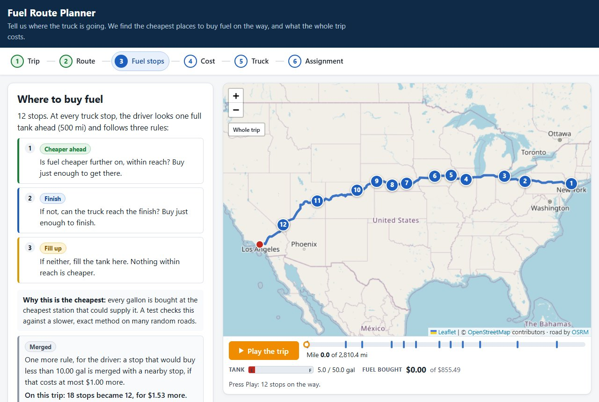

# Spotter Fuel Route API

A Django REST API for a truck trip inside the USA. Give it a start and a finish and it returns:

- the driving route, as map data and as a link to a map page;
- the **cheapest places to buy fuel** on the way, for a truck with a **500-mile range** and **10 miles per gallon**;
- how much to buy at each stop and the **total money spent on fuel**.

It calls a free routing API (OSRM) **once for a new trip** and **never** for a trip it has already planned.



---

## Quick start (5 commands)

Requires Python 3.12+ (Django 6.1). Tested with Python 3.14 on Windows 11.

```bash
python -m venv .venv
source .venv/bin/activate        # Windows PowerShell: .venv\Scripts\Activate.ps1 · Git Bash: source .venv/Scripts/activate
pip install -r requirements.txt
python manage.py migrate
python manage.py load_stations                           # ~2 s, geocodes all stations offline
python manage.py runserver                               # http://127.0.0.1:8000
```

Open http://127.0.0.1:8000/api/route/map, or ask the API directly:

```bash
curl "http://127.0.0.1:8000/api/route?start=New%20York,%20NY&finish=Los%20Angeles,%20CA"
```

Postman: import `postman/collection.json` (variable `baseUrl` = `http://127.0.0.1:8000`). Its 13 requests follow the order of the demo video.

## The page in six steps

The page at `/api/route/map` is a client of the same `GET /api/route` that Postman calls. It walks through one trip:

1. **Trip** (`#trip`): type a start and a finish (with suggestions of US places), or pick an example.
2. **Route** (`#route`): the road on the map, its length, the fuel it burns, the truck stops near it and how far apart their prices are.
3. **Fuel stops** (`#stops`): the three rules, each stop with the rule that chose it and why, and **Play trip** to watch the tank.
4. **Cost** (`#cost`): the total, a check that the stop costs add up to the cent, and a comparison with a driver who ignores prices.
5. **Truck** (`#truck`): change miles per gallon, miles on a full tank, safety fuel or the tank at the start, and plan again. The road is already saved, so this needs no new call to OSRM.
6. **Assignment** (`#assignment`): each point of the assignment, how it is met and the proof on this trip.

The `map.map_url` of every API answer opens the page at the Route step.

## The algorithm in plain words

**Candidates.** A truck stop of the price file is a candidate if it is within **10 miles** of the road (the *corridor*). Each candidate gets a mile marker: how far along the road it is.

**Three rules.** At every stop the driver looks one full tank ahead (500 miles) and asks:

1. **Cheaper ahead?** If a cheaper station is within reach, buy just enough fuel to get to the nearest one.
2. **Finish?** If not, and the finish is within reach, buy just enough to finish.
3. **Fill up.** If neither, fill the tank here: nothing within reach is cheaper. Then drive on to the cheapest station within reach.

**Why it is the cheapest.** Every gallon is bought at the cheapest station that could supply it. A gallon burned at mile *m* can only come from a station at most one tank before *m*, and the rules always buy it at the cheapest of those. This is the classic *greedy* solution of the "gas station problem" for a fixed road with one price per station. A test (`test_optimizer::test_greedy_matches_exact_dp`) checks it against a slower, exact method (dynamic programming) on 90 random roads.

**Tiny stops.** The rules alone may plan a stop that buys 2 gallons. A stop that buys less than **10 gallons** (`MIN_STOP_GALLONS`) is merged with a neighbour stop (*consolidation*), and each merge may cost at most **$1.00** more (`MAX_CONSOLIDATION_COST`).

**Example: New York, NY → Los Angeles, CA** (2,810.4 miles, real answer):

- Stop 2, Youngstown, OH, mile 396, $3.059 a gallon: fuel is cheaper in Toledo (mile 562, $3.009), so it buys just enough to get there: 16.6 gal. *Rule 1.*
- Stop 7, Waco, NE, mile 1,340, $2.799: the cheapest price on the whole road. Nothing within reach is cheaper, so it fills all 50 gallons. *Rule 3.*
- Stop 12, North Las Vegas, NV, mile 2,521: no cheaper fuel before the finish, so it buys just enough to finish. *Rule 2.*
- Stop 1, Palisades Park, NJ, mile 10: the rules alone buy 2.00 gal there. To avoid a tiny stop, it also buys the 32.6 gal planned at mile 70 and skips that stop, for $0.65 more.
- On this trip the merges take the plan from 18 stops to 12, for $1.53 more (0.2%).

**Speed.** Sorting the n candidates costs O(n log n) and each stop looks at the k stations within one tank: O(n log n + n·k), about 1 ms for the 458 candidates of New York → Los Angeles.

The code: `fuelroute/services/optimizer.py` (`_greedy` has one branch per rule, `_consolidate` does the merges) and `fuelroute/services/stations.py` (the corridor search, with numpy).

## API

### `GET /api/route` (or `POST /api/route` with the same fields as JSON)

| Parameter | Required | Example | Meaning |
|-----------|----------|---------|---------|
| `start` | yes | `New York, NY` or `40.71,-74.00` | where the trip starts, in the USA |
| `finish` | yes | `Los Angeles, CA` | where it ends |
| `start_tank` | no | `empty` (default) or `full` | `empty` = pay for every mile; `full` = leave with a free full tank (see below) |
| `mpg` | no | `8` | miles per gallon, 3 to 30 (default 10) |
| `max_range_miles` | no | `400` | miles on a full tank, 100 to 1500 (default 500); the tank is range ÷ mpg |
| `safety_reserve_gal` | no | `5` | fuel that must stay in the tank at every stop and at the finish (default 0) |

Advanced: `corridor_miles` (1 to 50, default 10), `price_policy` (the `median`, `min` or `max` price of a station listed several times), `consolidate` (`false` keeps the tiny stops) and `include=candidates` (adds every candidate station; the plan does not change). Any other parameter is a 400.

Response for New York, NY → Los Angeles, CA (real, 2026-10-07, trimmed):

```json
{
  "start":  {"query": "New York, NY", "label": "New York, NY", "lat": 40.66271, "lon": -73.93868, "geocoder": "offline"},
  "finish": {"query": "Los Angeles, CA", "label": "Los Angeles, CA", "lat": 34.01939, "lon": -118.41083, "geocoder": "offline"},
  "route":   {"distance_miles": 2810.4, "duration_hours": 50.31, "miles_outside_usa": 0.0},
  "vehicle": {"max_range_miles": 500.0, "miles_per_gallon": 10.0, "tank_gallons": 50.0, "start_tank": "empty", "safety_reserve_gal": 0.0},
  "summary": {
    "total_fuel_cost": 855.49,
    "total_gallons_purchased": 281.04,
    "number_of_stops": 12,
    "average_price_paid": 3.044,
    "start_fuel_gallons": 5.0,
    "end_fuel_gallons": 5.0,
    "comparison": {"savings_vs_price_blind": {"amount": 85.24, "percent": 9.1, "extra_stops": 6}, "...": "..."}
  },
  "warnings": [],
  "fuel_stops": [
    {
      "stop": 7, "name": "AKAL TRAVEL CENTER", "address": "I-80 EX 360", "city": "Waco", "state": "NE",
      "lat": 40.897, "lon": -97.46175, "mile_marker": 1340.0, "distance_from_route_miles": 5.2,
      "price_per_gallon": 2.799, "fuel_on_arrival_gallons": 0.0, "gallons": 50.0, "cost": 139.95,
      "decision": {"rule": "fill_up", "consolidated": false, "reaches": {"stop": 8, "mile": 1451.0}, "...": "..."}
    }
  ],
  "map": {
    "map_url": "http://127.0.0.1:8000/api/route/map?start=New+York%2C+NY&finish=Los+Angeles%2C+CA&start_tank=empty",
    "geojson": {"type": "FeatureCollection", "features": ["the route line", "start", "finish", "one point per stop"]}
  },
  "meta": {"external_api_calls": 1, "external_api_services": ["osrm"], "route_cache": "miss", "plan_cache": "miss", "settings_changed": []}
}
```

- Money is exact: each `cost` is `gallons × price_per_gallon` rounded to the cent, and the total is the sum of the stops.
- `decision`: which rule chose the stop and, for a merged stop, what moved into it and what that cost.
- `summary.comparison`: the same gallons for other drivers; `price_blind` ignores prices and fills up only when it must.
- `pipeline` (not shown): how the plan was made, from the corridor counts to the stops before and after the merges.
- Headers: `X-Response-Time-ms`, and `Server-Timing` with the time of each step, the OSRM call included.

### Errors

Every error has the same body: `{"error": "<code>", "detail": ..., "meta": {"external_api_calls": n, ...}}`.

| Status | `error` | When |
|--------|---------|------|
| 400 | `invalid_request` | missing or unknown parameter, bad format, a value out of range, coordinates outside the USA (`detail` per field) |
| 400 | `parse_error` | the JSON body is broken (also 405 `method_not_allowed`, 406 `not_acceptable`, 415 `unsupported_media_type`) |
| 400 | `location_not_found` | a place that cannot be found, or a state code that does not exist ("Austin, TZ") |
| 400 | `location_outside_usa` | "City, XX" with a Canadian province or a Mexican state ("Toronto, ON"), before any call |
| 400 | `same_location` | start and finish are the same place, even written differently ("Austin, TX" / "Austin, Texas") |
| 404 | `not_found` | unknown path under `/api/` |
| 422 | `no_fuel_data_in_region` | Alaska, Hawaii or a US territory: the price file has no stations there (checked before routing) |
| 422 | `location_not_near_road` | the point is more than 5 miles from a road |
| 422 | `no_route` | OSRM finds no road between the two places |
| 422 | `no_fuel_data_on_route` | the trip needs fuel and no station of the file is near the road |
| 422 | `no_reachable_fuel_station` | a stretch without stations is longer than the usable range; `gap_start` / `gap_end` say where |
| 429 | `rate_limited` | more than 60 trips per minute from one client (`Retry-After`) |
| 502 | `upstream_unavailable` | OSRM (or Nominatim) failed, after one retry |
| 503 | `upstream_busy` | OSRM (or Nominatim) is rate limiting us (`Retry-After`) |
| 503 | `station_data_not_loaded` | `load_stations` was never run |

### Other endpoints

- `GET /api/places?q=chi&limit=8`: type-ahead of US places from the offline index (0 external calls). The page uses it.
- `GET /api/about`: versions, truck defaults, parameter ranges, loaded data and the error codes. The page embeds it.
- `GET /api/route/map?start=...&finish=...`: the page. It plans nothing itself: its JavaScript calls `/api/route`.

## Assumptions and limits

- **Pay for every mile (`start_tank=empty`, the default).** The truck leaves with a 50-mile reserve (5 gal) and must arrive with the same 5 gal. The reserve is borrowed and given back, so the fuel bought is the fuel burned and the total is the cost of the whole trip. With `start_tank=full` the first tank is free and only the fuel bought on the way is counted.
- **The range is used to the limit.** With no safety fuel the truck may reach a station with 0.0 gallons: 500 miles taken literally. `safety_reserve_gal=5` keeps 5 gallons in the tank everywhere.
- **Coordinates are city-level.** The price file has no coordinates, so each station takes its city's position (US Census and GeoNames lists, offline). The 10-mile corridor absorbs most of that error.
- **The detour to a station is not charged.** Distances use the mile markers on the road; a station up to 10 miles off the road counts as on it.
- **Duration** comes from the public OSRM server, which uses a car profile, not a truck one.
- **Duplicated stations:** a station listed several times plans with the median of its prices.

### Known data gaps

- The price file has only 8 stations in California, all in the south-east. Los Angeles → New York works, but its first station is in Jean, NV (mile 251): the truck leaves with enough fuel to get there and the answer has a warning.
- The I-5 has no stations between Halsey, OR and Los Angeles: Seattle → Los Angeles is a 422 that says where the gap is.
- Alaska and Hawaii have no stations: a 422 before any routing call.

## External calls

| Request | Calls to OSRM |
|---------|---------------|
| A new trip | **1** (2 only if the first try fails and is retried) |
| The same trip again | **0** (plan cache, 1 hour) |
| The same trip with another truck or tank setting | **0** (route cache, 24 hours) |
| Invalid input, same place, outside the USA | **0** (rejected before routing) |
| `/api/places`, `/api/about`, the page itself | **0** |

Places are found in an offline index. Only free text that is not "City, ST" (a street address) goes to Nominatim, once, and is cached.

## Measured

On 2026-10-07, Windows 11, Intel Core Ultra 9 185H, Python 3.14, `runserver --noreload` (one process), requests sent one after another from the same machine. The time is the `X-Response-Time-ms` header. One call to OSRM in total.

| Request (New York, NY → Los Angeles, CA) | Calls | Time |
|------------------------------------------|------:|------|
| New trip | 1 | 1,450 ms (OSRM: 1,338 ms of it) |
| Same trip again (10 times) | 0 | 6.1 to 9.9 ms (median 6.7 ms) |
| Truck changed (5 different mpg and range settings) | 0 | 34 to 50 ms (median 38.5 ms) |

Almost all the time of a new trip is the wait for the public OSRM server.

## How it would scale

- **Redis** for the plan cache and the route cache, so every process shares them (today each process has its own).
- **Our own OSRM** with a truck profile, set with `OSRM_URL`: no fair-use limits, and truck durations.
- **PostGIS** with a spatial index when the price feed grows (today 6.5k stations fit in memory: about 20 ms per search).
- **Stateless workers** behind a load balancer: nothing is kept between requests except the caches.
- **A queue (Celery)** for batches of trips, so a big batch never blocks the API.

## Tests

`pytest` runs **839 tests** in about 6 s on the machine above, with no network: the only function that does HTTP fails in every test, and the tests that need OSRM get a fake that records each call. A few tests run the page's JavaScript in Node.js when it is installed (skipped otherwise).

- **Optimizer:** the rules against the exact method on 90 random roads, the merges (no gallon lost or invented, at most $1 each), a tank that never goes below empty or above full, and a price-blind driver that never beats the plan.
- **API:** exactly 1 call for a new trip and 0 for a repeat or another truck, costs that add up to the cent, every error code with the same body, retries, rate limits, data reloads and identical trips at the same time (one call).
- **Truck settings:** each setting changes the plan as it should with 0 calls, out-of-range values are a 400, and the default answers match a saved golden file.
- **Data:** the price file loader, place names, homonym cities, the corridor search against brute force, the US outline.
- **Page:** it never plans by itself, has no hand-written numbers, and asks exactly what Postman asks.

## Layout

```
config/                     Django settings and URLs
fuelroute/serializers.py    input validation
fuelroute/views.py, urls.py the JSON API
fuelroute/web.py            the map page (templates/, static/: HTML, CSS, JavaScript, no build step)
fuelroute/services/         planner.py (one trip, start to answer), optimizer.py (the rules and merges),
                            stations.py (the corridor), osrm.py (the routing call), geocoding.py, places.py
fuelroute/management/       load_stations: reads the price file
fuelroute/tests/            pytest
data/, postman/             price file, places index, US outline; the Postman collection
```

## Configuration

Environment variables:

| Variable | Default | What it changes |
|----------|---------|-----------------|
| `MAX_RANGE_MILES`, `MILES_PER_GALLON` | 500, 10 | the standard truck |
| `CORRIDOR_MILES` | 10 | how far from the road a station may be |
| `MIN_STOP_GALLONS`, `MAX_CONSOLIDATION_COST` | 10, 1.0 | the tiny-stop rule |
| `PRICE_POLICY` | median | the price of a station listed several times (applied by `load_stations`) |
| `OSRM_URL`, `NOMINATIM_URL` | public servers | the routing and free-text services |
| `PLAN_CACHE_SECONDS`, `ROUTE_CACHE_SECONDS` | 3600, 86400 | how long plans and roads are kept |
| `RATE_LIMIT_PER_MINUTE` | 60 | trips per minute per client (0 = off) |
| `REPO_URL`, `LOOM_URL` | this repository, empty | the links of `/api/about` and the page |
| `DJANGO_DEBUG`, `DJANGO_SECRET_KEY`, `DJANGO_ALLOWED_HOSTS` | false, random, localhost | Django |

## Data licences

See `data/NOTICE.md`. Fuel prices: the file given with the assignment. US Census Bureau files: public domain. GeoNames: CC BY 4.0. Map data © OpenStreetMap contributors (ODbL); routing by OSRM.
