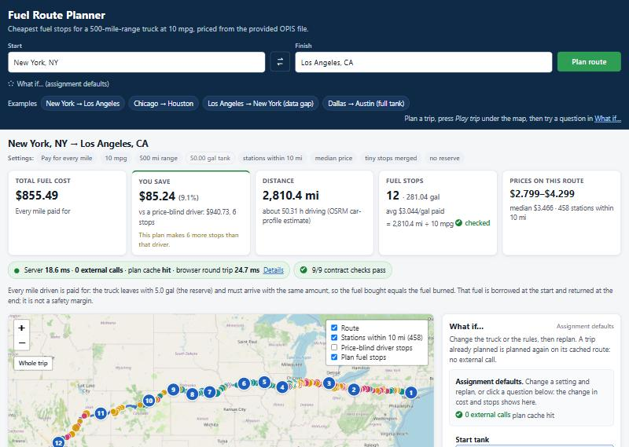
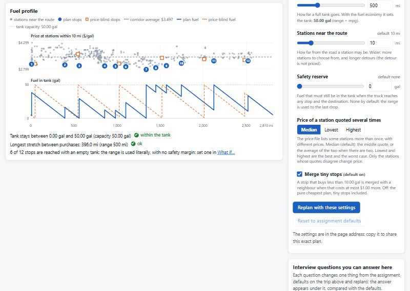
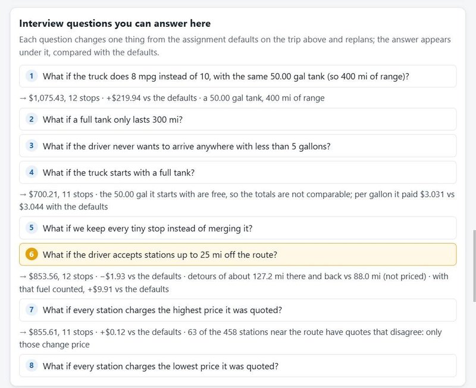

# Spotter Fuel Route API

A Django REST API that takes a start and a finish location in the USA and returns:

- the driving route (as GeoJSON, plus a link to an interactive map),
- the **cheapest places to fuel up** along the route, for a truck with a **500-mile range** and **10 MPG**,
- how many gallons to buy at each stop and the **total money spent on fuel**.

It makes **one call to a free routing API per new trip** (OSRM, no API key) and **zero** for a trip it has already planned, or for a *what-if* on a trip it has already routed (another mpg, range, corridor, price policy, safety reserve...). A new coast-to-coast trip takes about 1.4-3 s, almost all of it the public routing server; a repeated one 5-20 ms.

Open `http://127.0.0.1:8000/` in a browser for [the web UI](#web-ui): a client of the same API that shows the plan, why each stop was chosen, what it saves against a price-blind driver, a replay of the trip on the map, a *What if…* panel that answers the usual interview questions live, the evidence for every requirement of the brief, the test suite (runnable from the page), how it would scale and the measured performance of each request.

---

## Quick start (5 commands)

Requires Python 3.12+ (Django 6.1). Tested with Python 3.14 on Windows 11.

```bash
python -m venv .venv
source .venv/bin/activate        # Windows PowerShell: .venv\Scripts\Activate.ps1 · Git Bash: source .venv/Scripts/activate
pip install -r requirements.txt
python manage.py migrate
python manage.py load_stations                           # ~2 s, geocodes all stations offline
python manage.py runserver                               # http://127.0.0.1:8000
```

Try it:

```bash
curl "http://127.0.0.1:8000/api/route?start=New%20York,%20NY&finish=Los%20Angeles,%20CA"
```

Then open the `map.map_url` of the response in a browser: the planner page draws the same trip (from the cache, 0 external calls).

- Tests: `pytest` (896 tests, 10-25 s on a laptop, no network: a test that tried would fail). Four of them check the page's own JavaScript and run in Node.js when it is installed (skipped otherwise). The page's **Tests** tab runs the same suite.
- Benchmark: `python manage.py benchmark` (no network: it replays the route saved in `data/benchmark_route.json`; about 15 s; writes `data/benchmark.json`, shown in the page's **How it scales** tab).
- Postman: import `postman/collection.json` (variable `baseUrl` = `http://127.0.0.1:8000`).
- `DEBUG` is off by default. For Django's debug pages use `DJANGO_DEBUG=true`.
- Port 8000 busy? `python manage.py runserver 8010` and change `baseUrl`.

---

## API

### `GET /api/route` (or `POST /api/route` with a JSON body)

| Parameter    | Required | Example                          | Notes |
|--------------|----------|----------------------------------|-------|
| `start`      | yes      | `New York, NY` or `40.71,-74.00` | "City, ST", "City, State", "City ST", "Albany New York", "Washington, D.C." or "lat,lon" / "lat lon"; "City, XX" with a Canadian province or a Mexican state is rejected as outside the USA, with no call |
| `finish`     | yes      | `Los Angeles, CA`                | same formats |
| `start_tank` | no       | `empty` (default) or `full`      | see [Assumptions](#assumptions); blank = default |
| `include`    | no       | `candidates`                     | optional extra block, see below; does not change the plan |
| `mpg`        | no       | `8`                              | what-if: fuel economy, 3-30 (default 10) |
| `max_range_miles` | no  | `400`                            | what-if: range on a full tank, 100-1500 (default 500); the tank is range ÷ mpg |
| `corridor_miles` | no   | `25`                             | what-if: how far from the route a station may be, 1-50 (default 10) |
| `price_policy` | no     | `median` (default), `min`, `max` | what-if: which quote of a station listed several times |
| `consolidate` | no      | `true` (default), `false`        | what-if: merge stops under 10 gal into a neighbour (at most $1 per fix) |
| `safety_reserve_gal` | no | `5`                            | what-if: never arrive at a stop or at the destination with less; from 0 (default) to less than the tank |

Any other parameter is rejected with a 400 (a typo like `start_tnak=full` would otherwise be ignored silently). A trailing slash is optional.

**What-if settings change the plan, never the route.** They are part of the plan cache key but not of the route cache key, so on a trip already routed they cost **0 external calls** (`meta.route_cache: "hit"`, a re-plan of 40-210 ms). `meta.settings_changed` names the ones that differ from the defaults and `vehicle` carries every effective value (with `tank_gallons` and `usable_range_miles`); out-of-range values are a 400 under the field, and a setting that makes the trip impossible is a 422 that says why. Without them the API answers as before they existed, new fields aside: a golden test compares the default answers with those of the commit before them (one scenario, a capped last stretch, was regenerated after a deliberate change of the tank rule, see [Assumptions](#assumptions)).

Response (trimmed; `POST {"start": "Chicago, IL", "finish": "Houston, TX"}`, real output of 2026-10-06):

```json
{
  "start":  {"query": "Chicago, IL", "label": "Chicago, IL", "lat": 41.83705, "lon": -87.68494, "geocoder": "offline"},
  "finish": {"query": "Houston, TX", "label": "Houston, TX", "lat": 29.78574, "lon": -95.38881, "geocoder": "offline"},
  "route":   {"distance_miles": 1083.1, "duration_hours": 19.89, "miles_outside_usa": 0.0, "road_snap_miles": {"start": 0.0, "finish": 0.0}},
  "vehicle": {"max_range_miles": 500.0, "miles_per_gallon": 10.0, "tank_gallons": 50.0, "start_tank": "empty"},
  "summary": {
    "total_fuel_cost": 322.56,
    "total_gallons_purchased": 108.31,
    "fuel_used_gallons": 108.31,
    "start_fuel_gallons": 5.0,
    "end_fuel_gallons": 5.0,
    "unpriced_fuel_gallons": 0.0,
    "number_of_stops": 5,
    "average_price_paid": 2.9781,
    "candidate_stations_on_route": 179,
    "note": "Every mile driven is paid for: the truck leaves with 5.0 gal (the reserve) and must arrive with the same amount, so the fuel bought equals the fuel burned. That fuel is borrowed at the start and returned at the end; it is not a safety margin."
  },
  "warnings": [],
  "fuel_stops": [
    {
      "stop": 3, "opis_id": 69861, "name": "HUCKS FOOD & FUEL #379",
      "address": "I-57, EXIT 53", "city": "Marion", "state": "IL", "lat": 37.73445, "lon": -88.94116,
      "price_per_gallon": 2.999, "price_quotes": {"count": 3, "min": 2.929, "max": 3.549},
      "mile_marker": 313.0, "distance_from_route_miles": 1.0,
      "fuel_on_arrival_gallons": 0.0, "gallons": 13.6, "cost": 40.79
    }
  ],
  "map": {
    "map_url": "http://127.0.0.1:8000/api/route/map?start=Chicago%2C+IL&finish=Houston%2C+TX&start_tank=empty",
    "geojson": {"type": "FeatureCollection", "features": ["LineString of the route", "start/finish Points", "one Point per fuel stop"]}
  },
  "meta": {
    "external_api_calls": 1, "external_api_services": ["osrm"], "external_api_ms": 373.8,
    "route_cache": "miss", "plan_cache": "miss", "station_data_version": "6626-13252",
    "timings_ms": {"geocoding_ms": 0.3, "routing_ms": 390.9, "corridor_ms": 2.8, "optimizer_ms": 0.2, "response_build_ms": 1.9}
  }
}
```

- Money is computed in `Decimal`: each stop's `cost` is `gallons x price_per_gallon` rounded to the cent (prices keep the 4 decimals of the file), and `total_fuel_cost` / `total_gallons_purchased` are the sums of the stops, so they add up by hand.
- `price_quotes`: the file lists some stations several times with different prices; this shows how many quotes and their spread (see [The station data](#the-station-data-load_stations)).
- `warnings`: anything the user should know about this plan (first station beyond the reserve, route crossing Canada, unpriced fuel, a place found by free-text search and what it matched). Empty for normal trips.
- Every response has an `X-Response-Time-ms` header and a `Server-Timing` header (below).

The answer also explains itself. These fields were added without changing any existing one (same real request, trimmed):

```json
{
  "fuel_stops": [
    {"stop": 1, "mile_marker": 18.0, "...": "...", "decision": {
      "rule": "reach_cheaper", "cheaper_station_mile": 82.0, "consolidated": true, "greedy_gallons": 3.2,
      "moved_in": [{"mile": 82.0, "gallons": 12.4, "from_stop": null}], "moved_out": [],
      "consolidation_extra_cost": 0.25, "reaches": {"stop": 2, "mile": 206.0}, "fills_tank": false}},
    {"stop": 3, "mile_marker": 313.0, "...": "...", "decision": {
      "rule": "reach_cheaper", "cheaper_station_mile": 449.0, "consolidated": false, "greedy_gallons": 13.6,
      "moved_in": [], "moved_out": [], "consolidation_extra_cost": 0.0, "reaches": {"stop": 4, "mile": 449.0}, "fills_tank": false}}
  ],
  "summary": {
    "comparison": {
      "optimized":                    {"total_fuel_cost": 322.56, "number_of_stops": 5, "rule": "Buys each mile of fuel at the cheapest station that can supply it, then fixes stops under 10 gal when the fix costs at most $1.00."},
      "optimum_before_consolidation": {"total_fuel_cost": 321.26, "number_of_stops": 9, "stops": ["..."]},
      "price_blind":                  {"total_fuel_cost": 358.66, "number_of_stops": 3, "stops": ["..."]},
      "quarter_tank":                 {"total_fuel_cost": 384.55, "number_of_stops": 3, "stops": ["..."]},
      "corridor_average":             {"price_per_gallon": 3.3254, "stations": 179, "total_fuel_cost": 360.17},
      "savings_vs_price_blind":       {"amount": 36.1, "percent": 10.1, "extra_stops": 2},
      "savings_vs_corridor_average":  {"amount": 37.61, "percent": 10.4}
    }
  },
  "pipeline": {
    "computed_at": "2026-10-06T12:16:36.326624+00:00",
    "timings_ms": {"geocoding_ms": 0.3, "plan_cache_ms": 2.4, "routing_ms": 1095.3, "corridor_ms": 3.3, "optimizer_ms": 0.3, "response_build_ms": 2.2, "comparison_ms": 0.5},
    "external_api_calls": 1, "external_api_services": ["osrm"], "external_api_ms": 1079.0,
    "routing":   {"geometry": "polyline6", "polyline_chars": 55934, "geometry_points": 11892, "samples": 1085, "map_points": 741, "from_route_cache": false},
    "corridor":  {"stations_searched": 6544, "in_bounding_box": 1291, "after_coarse_pass": 245, "within_corridor": 179, "dropped_outside_usa": 0, "candidates": 179},
    "tank":      {"start_fuel_gallons": 5.0, "required_end_fuel_gallons": 5.0, "reason": "reserve", "arrival_capped": false},
    "optimizer": {"stops_before_consolidation": 9, "cost_before_consolidation": 321.26, "stops": 5, "consolidation_extra_cost": 1.3}
  }
}
```

- `fuel_stops[].decision`: why the stop exists and what it buys **in the final plan**. `rule` is the greedy branch that created it: `reach_cheaper` = a cheaper station was within one tank, so the greedy bought just enough to reach it (`cheaper_station_mile`); `fill_up` = none was, so it filled the tank; `finish` = the destination was within reach. Consolidation can then remove that cheaper station's stop, so the rest says what really happened: `greedy_gallons` (what the greedy bought here), `moved_in` (fuel the greedy had planned at another station, now bought here; `from_stop` null = that stop was removed), `moved_out` (fuel of this station moved to another stop), `consolidation_extra_cost` (what that fuel costs more at this price; summed over the stops it is the consolidation's cost), `reaches` (the next stop, or `stop: null` = the destination) and `fills_tank`. Above, stop 1 is there because a cheaper station was at mile 82, but that 12.4-gallon stop was merged into it (+$0.25), so it buys enough to reach stop 2 at mile 206.
- `summary.comparison` (null when the trip needs no purchase): the same route, stations, start fuel and end fuel planned other ways. `price_blind` drives until the next station is out of reach and then fills up; `quarter_tank` refuels at a quarter tank; `corridor_average` prices the same gallons at the average of the corridor. All of them buy the same gallons; savings can be negative and are shown as they are. `extra_stops` is honest about the trade-off: the cheapest plan often stops more.
- `pipeline`: how THIS plan was computed. It is cached with the plan, so a cache hit (0 calls, a few ms) still shows what the first computation cost.
- `include=candidates` adds `candidates` (`fields` + `rows`): every station within the corridor with its mile marker, distance to the route, price and the plan stop it became, if any. It does not change the plan and shares the plan cache, so after a normal request for the same trip it costs **0 external calls**. The web page uses it for the map layer and the price profile.
- `Server-Timing` (on every `/api/route` answer, errors included): `geocoding`, `plan-cache`, `routing`, `osrm` (the external call alone), `corridor`, `optimizer`, `build`, `comparison`, `candidates`, `render` (JSON serialisation) and `total` (= `X-Response-Time-ms`). Browsers show it in DevTools › Network › Timing.

### `GET /api/stats` and `GET /api/about`

Both make no external call, are exempt from the rate limit and answer in a few milliseconds (see [Measured performance](#measured-performance)).

- `/api/stats`: the server's own counters since the process started: route requests by status and by outcome (`cold`, `route_cache_hit`, `plan_cache_hit`, `error`), external calls by service, OSRM calls per routing request, latency p50 / p95 / max per outcome and for the OSRM call alone, error codes, the last 20 requests. No location text is kept. Per process: a restart (or `runserver`'s auto-reload) resets it. It also serves `benchmark`: the results of the last `python manage.py benchmark` (see [Measured performance](#measured-performance)).
- `/api/about`: what is running and why: versions (running and pinned), commit, configuration, a summary of the loaded station data, the external services, the parameters, the error catalog, the requirements of the brief mapped to the code (links with line numbers) and to the tests, and the results of the last local `pytest` run (`pytest` writes `.reports/pytest.xml`; the report is flagged `stale` when the code is newer).

### `GET /api/places?q=chi[, il]&limit=8`

The type-ahead of the page's Start and Finish fields: US places whose name starts with `q` (normalised like every lookup: accents, "St." = "Saint", case; after a comma, a state or the start of one), most populated first, from the same offline index the planner geocodes with: **0 external calls**, well under a millisecond. Each `label` plans to exactly the point shown; `plannable: false` marks Alaska and Hawaii (no station there). A name without population whose "<name> City" twin is within 6 miles is the same place under two names and ranks with the twin's population, so "New York, NY" (the form the examples use) comes first.

### `GET /api/tests` and `POST /api/tests/run`

- `GET`: every test file and test function with the first paragraph of its docstring (read from the source, nothing is imported), the last run and whether THIS request may start one (`runner.available`, `runner.detail`).
- `POST`: runs `python -m pytest` on the server with the same interpreter, a fixed command (nothing from the request reaches it), one run at a time (409), and answers every result grouped by file. It is a **local development tool**: on by default only under `manage.py runserver` (or with `DJANGO_DEBUG=true` or `ENABLE_TEST_RUNNER=1`; `DISABLE_TEST_RUNNER=1` turns it off), and even then only for a request that comes from the page on the same machine: loopback address and host name (no DNS rebinding), no proxy header, and an `Origin` equal to the host (browsers send it; Postman's request 22 sets it). Another machine, a proxy, another site or a bare `curl -X POST` get a 403; other machines see the counts of the last run but not its failure messages or output.

### `GET /api/route/map?start=...&finish=...[&start_tank=...]`

The [web UI](#web-ui) below. `map.map_url` of every answer points to it with the same inputs (what-if settings included).

### Errors

Every error has the same body: `{"error": "<code>", "detail": ..., "meta": {"external_api_calls": n, ...}}` (`meta` says what was spent before the error; extra fields per error below). That includes the framework's own errors (bad JSON, 405, 406, 415), the JSON 404 and the 429; a test walks the whole catalog.

| Status | `error`                     | When |
|--------|-----------------------------|------|
| 400    | `invalid_request`           | missing / unknown parameter, bad format, coordinates outside the USA (`detail` is per field) |
| 400    | `parse_error`, 405 `method_not_allowed`, 415 `unsupported_media_type` | malformed JSON, wrong method, wrong Content-Type |
| 400    | `location_not_found`        | a place name that cannot be geocoded, a state code that does not exist ("Austin, TZ", no call) or free text that only matched a street (`field` says which) |
| 400    | `location_outside_usa`      | "City, XX" with a Canadian province or a Mexican state ("Toronto, ON", "Monterrey, NL"; no call), or free text found abroad |
| 400    | `same_location`             | start and finish are the same place, even written differently ("Austin, TX" / "Austin, Texas") |
| 403    | `test_runner_unavailable`   | `POST /api/tests/run` from another machine, through a proxy, from another site or without an `Origin` (bare curl), or with the runner off |
| 404    | `not_found`                 | unknown path under `/api/` |
| 409    | `test_run_in_progress`      | a test run is already going |
| 422    | `no_fuel_data_in_region`    | start or finish in Alaska, Hawaii or a US territory ("San Juan, PR"): the price file has no stations there (checked before routing) |
| 422    | `location_not_near_road`    | the router had to move the point more than 5 miles to reach a road (sea, lake, wilderness); `snap_miles` |
| 422    | `no_route`                  | OSRM finds no drivable route |
| 422    | `no_fuel_data_on_route`     | the trip needs fuel and no station of the file is within the corridor (10 miles by default) |
| 422    | `no_reachable_fuel_station` | a stretch without stations longer than the range (500 miles, or the usable range with a safety reserve); `gap_start` / `gap_end` give mile and lat/lon |
| 429    | `rate_limited`              | more than 60 requests per minute from one IP to `/api/route` (`Retry-After`; the page itself is not counted) |
| 502    | `upstream_unavailable`      | the routing / geocoding service failed (after one retry) |
| 503    | `upstream_busy`             | the routing / geocoding service rate limited us (`Retry-After`) |
| 503    | `station_data_not_loaded`   | `load_stations` was never run (checked before routing) |
| 500    | `test_run_failed`           | pytest could not start, did not write a report or took longer than `TEST_RUNNER_TIMEOUT_SECONDS` |

---

## Web UI

Open **`http://127.0.0.1:8000/`** in a browser (or any `map.map_url` of an answer). It is a client of the same public API: the server renders only the shell (no planning, no external call) and the page calls `GET /api/route` with exactly the inputs Postman sends, plus `include=candidates` for the map layer, which shares the plan cache (0 calls right after a Postman request). Every number on it comes from an API answer, `/api/stats`, `/api/about` or the browser's own measurements; a test fails if the template or the JavaScript writes one by hand.



What it shows:

- **Start and Finish with city suggestions** from `/api/places` (0 external calls): arrow keys, Enter, Escape or the mouse; the part already typed in bold, read the way the server reads it ("st lou" → **Saint** **Lou**is); Alaska and Hawaii marked "no price data". "lat,lon" and free text still work.
- **The trip**: total cost (and whether every mile was paid or part of it had no station to buy from), what the plan saves against a price-blind driver (or what it costs more), distance, stops and gallons (= miles ÷ mpg, checked), the price range near the route; a badge with the server time, external calls, caches and browser round trip, and how many contract checks pass.
- **Map and fuel profile**: the route, the numbered stops, every station within the corridor coloured by price, the price-blind driver's stops, framed to fill the map clear of its controls; below, prices mile by mile and the tank level at every stop (it stays framed when the window is resized; legend folded on phones).
- **Play trip** (under the map): the truck drives the route, the tank gauge goes down and up at each stop, the stops light up as it passes them and the fuel bought adds up, in integer cents, to exactly the API's total ("to the cent"); 1×, 2×, 4×, pause and restart. With reduced motion it jumps to the end.
- **What if…** (beside the map): every what-if setting of the API with its default and limits (from `/api/about`), *Replan* on the cached route (0 calls), and the effect against the assignment defaults: cost, price per gallon, stops, gallons and the detours (there and back, not priced). Below, **eight interview questions** answered with one click, each in one line: 8 mpg with the same 50-gal tank (so 400 miles of range), a 300-mile tank, a 5-gal safety reserve, starting full (compared per gallon, since the full tank is free), keeping every tiny stop, stations up to 25 miles off the route (with the detours counted), and the highest or lowest quote of each station (with how many stations near the route have quotes that disagree). The settings live in the page address, so a link opens the same plan.
- **Plan**: each stop with *why* it is there in the final plan (the greedy rule, what consolidation moved and what it cost, how far the fuel takes the truck), the quote it used when the file lists the station several times, totals checked to the cent, the strategy comparison and exports (link, curl, JSON, GeoJSON, CSV, driver instructions, print).
- **Requirements**: every requirement of the brief, asked and between the lines, with how it is met, live evidence, links to the code on GitHub and the result of its tests in the last `pytest` run; ten contract checks recomputed in the browser (one applies only with a safety reserve); 21 edge cases run live against the server (Toronto, ON, Alaska, a gap longer than the range, broken JSON...).
- **Tests**: the whole suite, file by file, each test with the sentence that says what it proves, a filter, and **Run all tests**, which runs pytest on the server and shows every result (only when the server runs on your machine, see `/api/tests`).
- **Performance**: this request (server, external, our code, round trip, gzip transfer vs decoded size) and where the server time went (`Server-Timing`), the cache demo, a benchmark from the browser, the session log and `/api/stats` (OSRM calls per routing request, latency by outcome; p95 only from 20 samples).
- **How it scales**: the results of `manage.py benchmark` with the machine it ran on, what each kind of request costs on this server (a repeated trip, a what-if, a new trip: the OSRM call against our own code), and the next steps to scale (Redis, our own OSRM, PostGIS, more instances, a queue, precomputed lanes), each with the problem it solves, when it is needed and the measured number behind it.
- **How it works**: the pipeline of this answer with its numbers, the algorithm, the data, design decisions, known limits (with the live figures behind them) and how it was built (narrative, commit timeline from git, test inventory).
- **API**: the exact request (GET, curl, POST), the raw answer with headers, the parameters and the error catalog, each error with "Try it".





No build step: Django templates, plain ES modules and CSS in `fuelroute/static/`, served by the app itself (also with `DEBUG` off, no `collectstatic`); only Leaflet comes from a CDN, with Subresource Integrity, and if it cannot load the page still works without the map. The trip, its what-if settings and the tab live in the URL (`?start&finish&start_tank&mpg...#tab`). Usable on a phone (375 px: the form compacts, tables become cards) and with the keyboard and a screen reader (labelled tabs, errors announced). Links to the code point to the newest commit GitHub has, with that commit's line numbers; what is not pushed yet says so instead of linking to a 404.

---

## How it works

```
 start, finish ─► geocode ─► checks ─► route ─────► stations near ─► tank ─► optimizer ─► JSON + map
                  (offline,  (same     (OSRM,       the route         rules   (greedy +    (GeoJSON,
                   0 calls)   place,    1 call,      (numpy, ~20 ms)          consolida-   Decimal money)
                              AK/HI)    cached)                               tion, <2 ms)
```

1. **Validate** (`serializers.py`): formats, ranges, unknown parameters, and "is this point in the USA?" for coordinates. No lookup, under 1 ms, 0 external calls.
2. **Geocode** (`services/geocoding.py`): "lat,lon" is used as is. "City, ST" is looked up in an offline table of ~190k US places (Census Gazetteer + GeoNames, see below), 0 external calls. "City, XX" where XX is a Canadian province, a Mexican state, a US territory or no state at all is answered at once (outside the USA / no data / not found), also with 0 calls: Nominatim is restricted to the USA, so it would otherwise match the first US street named like the place ("Toronto, ON" became "Toronto Court" in Indianapolis). Only other free text (a street address, a landmark) goes to Nominatim, once, cached, at most 1 request per second; a hit that is only a street is rejected, and an accepted one is named in a warning. Every point is checked against the Census outline of the USA (`services/usa.py`).
3. **Cheap checks before routing** (`services/planner.py`): same place written two ways, Alaska / Hawaii (no price data), station table empty. These never spend the routing call.
4. **Plan cache**: the finished plan is cached by (station data version, coordinates, `start_tank` and every what-if setting), for an hour. A repeated trip returns in 5-20 ms with 0 external calls.
5. **Routing** (`services/osrm.py`, the one external call): `/route/v1/driving/{lon,lat};{lon,lat}?overview=full&geometries=polyline6`. The geometry (35k points coast to coast) is decoded with numpy, resampled every mile with its mile marker (scaled to OSRM's road distance), checked against the US outline, and simplified to ~50 m for the map (35k -> 2.6k points). Only this prepared route is cached (~100 KB), keyed by the coordinates alone, in a cache of its own (24 h, up to 200 routes): a what-if misses the plan cache but hits the route, and many what-ifs (one plan each) cannot push the route out. The connection to OSRM is pooled and reused between requests, and identical concurrent requests wait for one call ("single flight").
6. **Stations near the route** (`services/stations.py`): a station is a candidate if it is within **10 miles** of the route. Vectorised with numpy on 3D unit vectors (nearest point = largest dot product), in three passes so the exact one only sees a few hundred stations:
   - bounding box of the route,
   - coarse pass against one sample every 20 miles,
   - exact nearest sample for the survivors.
   Coast to coast: ~5,000 stations -> ~460 candidates in about 20 ms. A test compares it with a brute-force haversine search. Stations whose nearest route point is outside the USA are dropped (they can only be reached by crossing the border).
7. **Tank rules** (`planner._tank_rules`): how much fuel the truck leaves with and must arrive with (see [Assumptions](#assumptions)).
8. **Optimizer** (`services/optimizer.py`, pure Python). The classic "gas station problem" greedy, optimal for a fixed route with linear prices:
   - if a **cheaper** station is within one tank, buy just enough fuel to reach the nearest one;
   - else, if the destination is within one tank, buy just enough to finish;
   - else, **fill the tank** and go to the cheapest station within one tank.
   Every mile is driven on fuel bought at the cheapest station that could have supplied it. A test checks it against an exact dynamic-programming solution on 90 random routes (with a final reserve, a full tank and random tanks, stations in the start and destination cities).
   Then a **consolidation** step fixes stops that buy less than 10 gallons, with a neighbour stop: first by removing a stop (merge it into a neighbour, or move the neighbour's purchase into it), else by topping it up to 10 gallons; the cheapest move wins and a move may cost at most $1. On New York -> Los Angeles this takes the plan from about 18 to 12 stops for about $1.50 more (0.2%). Each final stop records where its fuel was planned by the greedy, so the response explains the final plan; a test checks that no gallon is lost or invented and that the per-stop costs add up to the consolidation's cost.
   Complexity: O(n log n + n·k), with n the candidate stations and k those within one tank (about 2 ms coast to coast).
9. **Response**: stops with exact money and the reason for each purchase, summary with the strategy comparison, warnings, GeoJSON FeatureCollection, `pipeline` (how the plan was computed, cached with it), `meta` with the external calls and timings of this request, and the `Server-Timing` header.

### The station data (`load_stations`)

The price file has no coordinates, so they are added **once, offline**, when the data is loaded:

```
$ python manage.py load_stations
Rows read:            8,151
Invalid rows skipped: 0
Unique stations (ID): 6,738  (price policy: median)
Non-US skipped:       112
Geocoded:             6,544 / 6,626 (98.8%) {'census': 6170, 'geonames': 374}
  homonym cities resolved from the address: 371
Ambiguous city (left without coordinates): 82
  - Ridgeway, VA (3)
  - Buffalo, TX (3)
  ...
City not found:       0
```

- **Duplicates.** 678 OPIS IDs appear more than once: same address, same city, same rack ID, different price, and the file has no date to tell which quote is current. The planner uses the **median** of a station's quotes (robust to one odd quote; `PRICE_POLICY=min` or `load_stations --price-policy min` uses the lowest). The response shows the number of quotes and their min / max for every stop.
- **Non-US rows.** 112 stations are in Canada (ON, AB, BC...). They are skipped: the offline places table covers only the USA and trips must start and end in the USA. A route can still cross Canada (see [Known data gaps](#known-data-gaps-and-faq)).
- **Coordinates.** Matched by (city, state) against `data/us_places.csv.gz` (2.8 MB, committed), built by `scripts/build_places_dataset.py`:
  1. **US Census Gazetteer** "Places" 2025 (public domain): every incorporated place and CDP, with an internal point, its status (incorporated or CDP) and land area.
  2. **GeoNames** US populated places (CC BY 4.0): fills the gaps (small unincorporated communities, where many truck stops are) and gives the population. Minor civil divisions ("Town of Willington") only for names nothing else has, which is how New England towns are found.
  Names are normalised before matching: case, accents, punctuation, a leading "The", "St." -> Saint, "Ste" -> Sainte, "Ft" -> Fort, "Mt" -> Mount, leading "S"/"N" -> South/North, and a second try without spaces ("Mc Lean" = "McLean").
- **Homonyms.** A state can have several places with the same name (Tennessee has 12 "Antioch"; "Marietta, OK" is both a town on I-35 and a hamlet 190 miles away). The places file keeps all of them, best first (population, then incorporated > CDP > hamlet). For a station whose city name is ambiguous (two candidates more than 25 miles apart), the loader uses its address:
  - **exit number**: interstate exits are numbered by mile marker, so another station on the same interstate with a close exit number tells where it is ("Antioch, TN - I-24, EXIT 62" is next to "La Vergne - I-24, EXIT 64", i.e. Nashville);
  - **population**: one candidate is a town of 5,000+ people and the others are at least 20 times smaller ("Chesapeake, VA");
  - **highway**: only when the two clues above do not apply, the candidate near another station on the same highway.
  When the clues disagree, or none applies, the station is **left without coordinates** (82 stations, 1.2%) instead of being placed hundreds of miles away, where it would show up as a phantom candidate on other routes.
- `scripts/build_places_dataset.py` and `scripts/build_us_mask.py` rebuild the data files from the original sources (they download ~72 MB once into the ignored `data/raw/`).

Why not geocode each address with an API? 6.6k calls to a free geocoder take hours with fair-use limits, and the "addresses" are interstate exits ("I-44, EXIT 283 & US-69") that geocoders do not resolve well. A city centroid is usually within a few miles of the exit (in big cities it can be 10-20 miles, e.g. a truck stop at the edge of Jacksonville); the 10-mile corridor absorbs most of that, and `distance_from_route_miles` is approximate.

---

## Assumptions

- **Vehicle:** 500-mile range, 10 MPG, so a 50-gallon tank. All values are in `settings.FUEL_PLANNER` and can be changed with environment variables.
- **Start fuel (`start_tank`):**
  - `empty` (default): **every mile driven is paid for**. The truck leaves with a **50-mile reserve** and must **arrive with the same amount**, so total gallons bought = distance / 10. I picked this as the default because "total money spent on fuel" should be the cost of the trip, not the trip minus a free first tank.
    - If the **first station** of the file on the route is further than 50 miles (Houston: mile ~75; Los Angeles: mile 251, because the file has only 8 stations in California), the truck leaves with just enough fuel to reach it and must arrive with that same amount ("return the tank as you got it"), so every mile is still paid. The response says so in `warnings`.
    - If the **last station** is so far from the destination that arriving with that fuel is impossible (last stretch over 450 miles), the truck leaves with less: what it can still have on arrival (a full tank at the last station minus the last stretch), so every mile is still paid. Only when that is too little to reach the first station does it arrive with less than it left with; the difference is reported as `unpriced_fuel_gallons` with a warning.
    - A short trip with **no station** on the route at all is planned with 0 stops (the reserve covers it) and the burned fuel is reported as unpriced; a longer one answers 422 `no_fuel_data_on_route`.
  - `full`: the truck leaves with a full tank and arrives with whatever is left. Only the fuel bought on the way is counted (`unpriced_fuel_gallons` = the free tank). A trip under 500 miles has no stops and costs $0.
  - The reserve of `empty` is an accounting device, not a safety margin: borrowed at the start and returned at the end so that the fuel bought equals the fuel burned. That is why `empty` arrives with 5 gal and `full` may arrive with 0: neither keeps a margin between stops (next point).
- **Price:** the station's retail price from the file; the median of its quotes when it is listed several times (the average of the two when there are two); `price_policy=min` or `max` plans with its lowest or highest quote.
- **"Optimal"** means the lowest fuel cost, then the consolidation step trades at most $1 per fix for fewer tiny stops. Time and detour are not priced.
- **Range check:** distances between stops use the mile markers on the route. The detour to a station (`distance_from_route_miles`, at most 10 miles, measured from a city centroid) is not deducted from the range, and there is no safety margin by default, so the plan often arrives at a stop with 0.0 gallons. That is the 500-mile range taken literally; ask for `safety_reserve_gal=5` (or set `MAX_RANGE_MILES=450`) for a margin.

---

## Edge cases handled

| Case | Behaviour | Test |
|------|-----------|------|
| No station in the first 50 miles (Los Angeles, Houston, San Francisco) | 200: leaves with enough to reach the first station, arrives with the same; warning | `test_api::test_first_station_beyond_the_reserve_is_planned_not_rejected` |
| Last stretch a little too long to arrive with the reserve (a 300-mile range on New York -> Los Angeles) | 200: leaves with what it can arrive with, every mile still paid, no warning | `test_what_if::test_a_last_stretch_just_over_the_reserve_still_pays_every_mile` |
| Last stretch far too long to arrive with the reserve | 200: arrives with less, `unpriced_fuel_gallons` > 0, a warning with both amounts | `test_api::test_last_stretch_too_long_for_the_reserve_arrives_with_less`, `test_what_if::test_an_unpriced_last_stretch_names_two_different_amounts` |
| Short trip, no station on the route | 200, 0 stops, fuel reported as unpriced | `test_api::test_short_trip_with_no_station_on_the_route` |
| Trip needs fuel, no station on the route | 422 `no_fuel_data_on_route` | `test_api::test_trip_needing_fuel_with_no_station_on_the_route_is_422` |
| Stretch without stations longer than 500 miles | 422 with `gap_start` / `gap_end` (mile, lat, lon) | `test_api::test_gap_longer_than_the_range_is_422_and_says_where`, `test_optimizer::test_unreachable_*` |
| Stations in the destination city (same centroid as the finish) | used to buy the final reserve (no false 422, no dearer plan) | `test_optimizer::test_station_in_the_destination_city_*`, DP test |
| Optimality | greedy = exact DP on 90 random routes, three tank modes | `test_optimizer::test_greedy_matches_exact_dp` |
| Tiny stops ("2 gallons at mile 10") | merged / absorbed / topped up, at most $1 per fix | `test_optimizer::test_small_first_stop_absorbs_the_next_stop`, `test_consolidation_*` |
| Cents must add up | `sum(cost) == total`, `gallons x price == cost` | `test_api::test_stop_costs_add_up_to_the_total_to_the_cent` |
| Same place written differently / as coordinates | 400 `same_location`, no routing call | `test_api::test_same_place_written_differently_is_400_without_routing` |
| Point outside the USA (Toronto, Monterrey, Whitehorse, Gulf, Atlantic, Paris) | 400, no external call | `test_api::test_points_outside_the_usa_are_400_without_calls`, `test_geo::test_us_mask` |
| A place written with a region that is not a US state ("Toronto, ON", "Vancouver BC", "Monterrey, Nuevo León", "San Juan, PR", "Austin, TZ") | 400 `location_outside_usa` / 422 `no_fuel_data_in_region` / 400 `location_not_found`, no external call (regression: "Toronto, ON" was planned as a street in Indianapolis) | `test_api::test_places_written_with_a_region_outside_the_states_are_rejected_without_calls`, `test_geocoding::test_regions_outside_the_states_are_rejected_without_a_lookup` |
| Free text that only matches a street | 400 `location_not_found` naming the street; the rejection is cached | `test_api::test_a_street_matched_by_free_text_is_not_a_place` |
| Free text matched by Nominatim | planned, with a warning that names what it matched | `test_api::test_free_text_match_is_planned_with_a_warning_that_names_it` |
| Alaska / Hawaii | 422 `no_fuel_data_in_region`, no routing call | `test_api::test_alaska_and_hawaii_are_422_before_routing` |
| Point far from any road | 422 `location_not_near_road` | `test_api::test_point_far_from_any_road_is_422` |
| Route crossing Canada (Detroit -> Buffalo) | warning with the miles outside the USA; stations reachable only from Canada not used | `test_api::test_route_through_canada_warns_and_reports_the_miles`, `test_geo::test_corridor_drops_stations_seen_only_from_outside_the_usa` |
| Homonym cities (user input and stations) | most populated place for input; address clues or left out for stations | `test_geocoding::test_offline_lookups`, `test_station_loader::test_homonyms_are_resolved_from_the_address_or_left_out` |
| "City State" without comma, "Washington, D.C.", "Bronx" | resolved offline | `test_geocoding::test_split_city_state`, `test_offline_lookups` |
| Free text | Nominatim once, cached, 1 request/second; a 403/400 is a 502 and is not cached | `test_geocoding::test_nominatim_*`, `test_free_text_*` |
| Missing / unknown / blank parameters, "???" | 400 with the field, or the default for a blank `start_tank` | `test_api::test_invalid_input_returns_400`, `test_blank_start_tank_means_the_default` |
| Malformed JSON, wrong method / Content-Type / Accept, trailing slash, unknown path, rate limit | same JSON error format, `meta` included | `test_api::test_every_error_code_of_the_catalog_has_the_same_body_with_meta`, `test_trailing_slash_and_unknown_paths` |
| OSRM transient failure / down / rate limited | 1 retry; 502; 503 + Retry-After | `test_api::test_transient_failure_is_retried_once`, `test_routing_service_down_returns_502`, `test_rate_limited_upstream_returns_503_with_retry_after` |
| Too many requests from one client | 429 + Retry-After; reloading the page does not count | `test_api::test_own_rate_limit_answers_429`, `test_rate_limit_counts_the_endpoint_not_the_page` |
| `load_stations` run while the server is up | new data used on the next request, no restart, no 500 | `test_api::test_new_station_data_is_used_without_restart`, `test_station_loader::test_reload_changes_the_data_version_*` |
| `load_stations` never run | 503 `station_data_not_loaded`, no routing call | `test_api::test_no_station_data_loaded_is_503_without_calling_osrm` |
| Identical concurrent requests | one routing call | `test_api::test_identical_concurrent_requests_make_one_routing_call` |
| Duplicated stations in the file | median price (configurable), quote spread in the response | `test_station_loader::test_parse_keeps_every_quote_*`, `test_load_stores_the_policy_price_and_the_spread` |
| Errors on the web page | readable lines under the right field, the gap on the map, a Retry-After countdown; the page itself never plans | `test_web::test_page_with_inputs_prefills_the_form_and_makes_no_external_call`, edge cases tab |
| Hostile input in the page URL | escaped in the form and in the embedded JSON | `test_web::test_page_with_inputs_prefills_the_form_and_makes_no_external_call` |
| Unknown `include` value | 400 with `detail.include` | `test_api::test_unknown_include_value_is_400` |
| A what-if on a trip already routed | 0 external calls, `settings_changed` names it | `test_web::test_every_interview_question_is_answered_without_an_external_call`, `test_what_if::test_each_setting_changes_the_plan_with_no_external_call` |
| Many what-ifs fill the plan cache | the route stays cached: still 0 calls | `test_what_if::test_a_flood_of_plans_does_not_evict_the_route` |
| Out-of-range what-if, or one that makes the trip impossible | 400 under the field; 422 that says which stretch and why | `test_what_if::test_out_of_range_settings_are_400`, `test_safety_reserve_that_cannot_be_kept_is_422_and_says_why` |
| Rounding never shows a tank above full (62.5-gal tank at 8 mpg) | arrival + purchase <= the tank, to the hundredth | `test_what_if::test_rounded_arrival_plus_purchase_never_shows_a_tank_above_full` |
| The page's test runner from another machine, a proxy, a DNS-rebinding name, another site or curl | 403, pytest never started | `test_testrunner::test_runner_answers_403_unless_the_request_is_local`, `test_a_site_whose_name_points_at_this_machine_cannot_start_a_run`, `test_a_request_that_does_not_say_where_it_comes_from_cannot_start_a_run` |

---

## Known data gaps and FAQ

**California, Alaska, Hawaii.** The price file has only **8 stations in California**, all in the Imperial / Coachella valleys (Calexico, El Centro, Brawley, Coachella...), and **none in Alaska or Hawaii**. Consequences:
- Los Angeles -> New York works: the truck leaves with 25.1 gal to reach the first station (Jean, NV, mile 251), see the warning in the response.
- The I-5 corridor has no stations between Halsey, OR and Los Angeles: Seattle -> Los Angeles answers 422 `no_reachable_fuel_station` even with a full tank (the response says where the gap is).
- A trip inside California that needs fuel (Los Angeles -> San Francisco) answers 422 `no_fuel_data_on_route`; with `start_tank=full` it is planned with no stops.
- Alaska / Hawaii are recognised as US but answered with 422 before spending the routing call.

**Routes through Canada.** OSRM's fastest road from Detroit to Buffalo runs ~250 miles through Ontario. The plan uses US stations only (the 112 Canadian stations of the file are skipped), stations that can only be reached from the Canadian part are not offered, and the response warns with `miles_outside_usa`.

**Why does the truck arrive at stops with 0.0 gallons?** Because the range is taken literally (500 miles) and the greedy only buys what it needs. Ask for `safety_reserve_gal=5` (the *What if…* panel has it) or set `MAX_RANGE_MILES=450` for a margin.

**How are prices updated?** Run `python manage.py load_stations` (also while the server is up). The table gets new rows; every server process notices the new data version on its next request (one tiny aggregate query) and stops using cached plans of the old data.

**Several workers?** The caches are per process (`LocMemCache`: plans in `default`, prepared routes in `routes`). With several workers point both at Redis (`django.core.cache.backends.redis.RedisCache`, plus `pip install redis`) so they share routes and plans. The single flight of the routing call, the 1 request/second pacing of Nominatim, the counters of `/api/stats` and the test runner's lock stay per process; sharing them needs a lock in the cache (`cache.add`). Memory: ~185 MB resident per process as measured by the benchmark (the places index is ~55 MB in numpy arrays and two dicts; cached routes ~100 KB each, at most 200; plans ~60 KB, at most 500 cache entries).

**What if OSRM is down or slow?** One retry for connection errors, timeouts and 502/503/504 (connect timeout 3 s, read timeout 15 s), then 502; a 429 becomes 503 with `Retry-After`. The public OSRM server is a demo with no SLA: for production run your own OSRM (or a paid router) and set `OSRM_URL`.

**Why numpy and not PostGIS / a KD-tree?** 6.6k stations fit in memory and the vectorised search takes ~20 ms coast to coast, with no extra infrastructure. With millions of points a spatial index would be the next step.

**Why does the dev server sometimes call OSRM again for a trip it planned?** The cache lives in the process: restarting the server (or `runserver`'s auto-reload after a code change) clears it.

---

## External API calls

| Request                                   | Calls | Service |
|-------------------------------------------|-------|---------|
| New trip, "City, ST" or "lat,lon" inputs  | **1** | OSRM `route` (2 if the first try fails and is retried) |
| Same trip again (any text that resolves to the same coordinates) | **0** | plan cache |
| Same trip with the other `start_tank`     | **0** | route cache |
| A what-if on a trip already routed (mpg, range, corridor, price policy, consolidation, safety reserve) | **0** | route cache |
| Planner page shell (`/api/route/map`, `/`) | **0** | never plans; its JavaScript calls `/api/route` |
| The page's own request right after a plan (`include=candidates`) | **0** | plan cache (1 if the plan expired) |
| `/api/stats`, `/api/about`                | **0** | the server's own data |
| `/api/places` (the city suggestions)      | **0** | offline places index |
| `/api/tests`, `POST /api/tests/run`       | **0** | pytest runs with the routing and geocoding services faked |
| `python manage.py benchmark`              | **0** (1 the very first time, to save the route) | replays `data/benchmark_route.json` |
| Invalid input, same place, Alaska / Hawaii / territories, "City, XX" outside the US states, no station data | **0** | rejected before routing (and before any geocoding call) |
| Free text that is not "City, ST" (an address, "Dallas" without state) | +1 per new text | Nominatim (cached 24 h, misses 30 min, 1 request/second) |

`meta.external_api_calls` in every response, including errors, reports the real number for that request.

---

## Measured performance

Local machine (Windows 11, Python 3.14, `runserver`), real OSRM public server, 2026-10-06, after the strategy comparison, `pipeline` and `Server-Timing` were added:

| Request                                 | Miles  | Stops | Total cost | Gallons | External calls | Time (`X-Response-Time-ms`) |
|-----------------------------------------|-------:|------:|-----------:|--------:|---------------:|----------------------------:|
| New York, NY -> Los Angeles, CA         | 2810.4 | 12    | $855.49    | 281.04  | 1              | 821 ms (OSRM: 724 ms) |
| same, again (plan cache)                |        |       |            |         | 0              | **5.1-6.7 ms** |
| same, `include=candidates` (the page's request; 458 rows) |  |  |      |         | 0              | 7.9-10.6 ms |
| same, `start_tank=full` (route cache)   | 2810.4 | 11    | $700.21    | 231.04  | 0              | 38 ms |
| Chicago, IL -> Houston, TX (POST, plan cache) | 1083.1 | 5 | $322.56  | 108.31  | 0              | 3.0-3.8 ms |
| Los Angeles, CA -> New York, NY         | 2810.7 | 13    | $859.61    | 281.07  | 1              | 808 ms (OSRM: 707 ms) |
| Paris coordinates -> Austin (invalid)   |        |       | 400        |         | 0              | 2.0 ms |
| planner page shell                      |        |       |            |         | 0              | 9.2 ms (112 ms the first time: `/api/about` reads git and the test report once) |
| `/api/stats` / `/api/about`             |        |       |            |         | 0              | 0.4 ms / 7.9 ms |

- `Server-Timing` of the first New York -> Los Angeles request: geocoding 0.3, plan-cache 2.9, routing 779.9 (of which OSRM 723.9), corridor 25.0, optimizer 1.1, build 6.9, comparison 1.0, JSON render 1.5, total 821.2 ms. Our own work is ~100 ms for a coast-to-coast trip; `routing` includes ~55 ms of decoding / resampling / simplification after the call.
- From the browser (the page's Performance tab, benchmark of 10 sequential GETs of a cached trip): server p50 3.4 ms, round trip p50 6.5 ms. The same tab measures every request you make, so these numbers can be checked live.
- Reusing the HTTPS connection matters: a first call on a fresh connection measured 1,079 ms for Chicago -> Houston (`pipeline.external_api_ms`), against ~375 ms on a pooled one in earlier runs.
- The strategy comparison (`comparison` in `Server-Timing`) measured 1.0 ms on New York -> Los Angeles and 11.0 ms on Los Angeles -> New York.
- On start-up the server pre-loads the places index, the US mask, the station arrays and numpy (`fuelroute/warmup.py`, ~0.7 s), so the first request does not pay for that.
- `polyline6` is ~5x smaller than GeoJSON uncompressed and ~2x smaller gzipped (OSRM answers gzipped): ~120 KB instead of ~250 KB on a coast-to-coast trip.
- Times are for `Accept: application/json` (Postman, curl, browsers). The browsable HTML API is only enabled with `DJANGO_DEBUG=true`.
- Responses are gzipped for clients that accept it (`GZipMiddleware`): the page's coast-to-coast answer (with `include=candidates`) measured 36.2 KB on the wire for 111.2 KB of JSON; the page's Performance tab shows both for every request.
- Re-measured after gzip and the review fixes (2026-10-06, fresh `runserver` on port 8077, real OSRM): New York -> Los Angeles cold **1,529 ms** with 1 call (OSRM 1,441 ms, so ~88 ms of our own work), 25.5 KB on the wire for 74.9 KB of JSON, same 12 stops, $855.49 and 281.04 gal; the repeat **7.4 ms** with 0 calls (plan cache). The page shell: 25.1 KB gzipped for 116.5 KB, 17-27 ms.
- After the what-if settings (2026-10-06, afternoon, fresh `runserver` on port 8077, real OSRM, 3 calls in all): from the page, New York -> Los Angeles cold **2,915 ms** with 1 call (OSRM 1,812 ms), same $855.49 and 12 stops; the eight interview questions on that trip **48-210 ms each with 0 calls** (route cache); repeats 14-19 ms. With curl on another fresh server: Chicago -> Houston cold 1,372 ms (OSRM 1,327 ms), New York -> Los Angeles cold 2,089 ms (OSRM 1,006 ms), its repeat 14.2 ms and a what-if (`mpg=9.5`) 74.6 ms, both with 0 calls.
- Single live numbers are noisy on this laptop (Core Ultra 9 185H, Windows 11): a server in a background console can be scheduled on efficiency cores, so the corridor search plus the optimizer took 22-45 ms (p50) in the benchmark, while the corridor search alone took 370 ms in one live request. Read them as orders of magnitude; the benchmark below repeats each case many times.

### Benchmark (`python manage.py benchmark`)

It plans New York -> Los Angeles inside one process, without network: the route is the OSRM answer saved once in `data/benchmark_route.json` (the command makes that one call only when the file is missing, or with `--refresh-route`), fed through the same code a live answer goes through. It writes `data/benchmark.json`, which `/api/stats` serves and the page's **How it scales** tab shows with the machine it ran on. Last run (2026-10-06; Intel Core Ultra 9 185H, 16 cores / 22 logical processors, Windows 11, Python 3.14):

| Scenario | What it measures | Runs | p50 | p95 | Per second (at most) |
|----------|------------------|-----:|----:|----:|---------------------:|
| `plan_cache_hit` | a repeated trip, through the whole Django stack | 300 | 6.8 ms | 14.9 ms | 126 |
| `what_if_replan` | a different mpg each time: re-planned on the cached route | 100 | 43.4 ms | 89.8 ms | 20 |
| `new_trip_our_code` | a new trip with OSRM's saved answer replayed at once: everything but the wait for OSRM | 20 | 120 ms | 165 ms | 8 |
| `planning_no_network` | corridor search + tank rules + optimizer alone | 100 | 29.1 ms | 54.0 ms | 29 |
| `route_preparation` | decoding and preparing OSRM's polyline | 20 | 105 ms | 161 ms | 9 |

- 0 external calls while measuring (21 replays of the saved answer); 183 MB resident at the end; 6,544 usable (geocoded) stations, 458 near the route.
- "Per second" is iterations / total time in one thread with Django's test client (no sockets, no HTTP parsing): an upper bound for one process, not its capacity behind a real server.
- On this laptop the p50s move between runs: five runs the same afternoon gave 117-214 ms for `new_trip_our_code`. Against an OSRM call of 1-2 s, our own code is still a small part of a new trip, which is why trips and routes are cached.

---

## Project layout

```
config/
  settings.py                settings; the FUEL_PLANNER block holds every planner option
  urls.py, wsgi.py           root URLs (/ index, the planner page, /static/, /api/), WSGI entry (+ warm-up)
fuelroute/
  models.py                  FuelStation (OPIS id, price + quote spread, city-level lat/lon)
  serializers.py             input validation (formats, USA check, unknown parameters, include)
  views.py                   /api/route (GET/POST), /api/stats, /api/about, JSON errors, Server-Timing
  web.py                     the planner page shell and its static files
  urls.py                    API routes (optional trailing slash, JSON 404)
  middleware.py              X-Response-Time-ms and Server-Timing totals, per-IP rate limit, request metrics
  renderers.py               JSON renderer that measures its own time
  warmup.py                  pre-loads data at process start
  services/
    planner.py               orchestrates one request: what-if settings, checks, caching, tank rules, response
    geocoding.py             lat,lon / offline "City, ST" / Nominatim fallback
    places.py                offline place index with homonyms (Census + GeoNames), the /api/places type-ahead
    usa.py                   "is this point in the USA?" (Census outline raster)
    osrm.py                  the routing call, polyline6 decoder, route preparation
    http.py                  pooled HTTP client: timeouts, one retry, call counting
    geo.py                   numpy geometry: haversine, resample, nearest point, RDP
    stations.py              station arrays + corridor search, data version
    optimizer.py             cheapest refuelling plan (greedy + consolidation)
    station_loader.py        CSV parsing, price policy, offline geocoding, homonyms
    text.py                  place-name and state normalisation
    errors.py                domain errors -> HTTP status + error code
    metrics.py               per-process counters behind /api/stats
    about.py                 /api/about: versions, data, requirements -> code and tests, last pytest run
    testrunner.py            /api/tests: the test inventory and the page's (local only) pytest run
    benchmark.py             manage.py benchmark: offline measurements -> data/benchmark.json
  management/commands/load_stations.py, benchmark.py
  templates/fuelroute/planner.html (+ partials/)   the page shell: form, tabs, data-live placeholders
  static/fuelroute/css/planner.css
  static/fuelroute/js/       ES modules, no build step:
    main.js                  state, URL, tabs, planning, error states
    api.js                   fetch + Resource Timing + Server-Timing, session log, benchmark
    format.js                formatting, safe DOM building, data-live binding, derived values
    checks.js                contract checks in integer cents, tank trace
    map.js, profile.js       Leaflet layers; the price / tank SVG profile
    plan.js, requirements.js, performance.js, how.js, apitab.js   the tabs
    settings.js, whatif.js   the what-if settings, their effect and the interview questions
    places.js                the Start / Finish suggestions (ARIA combobox over /api/places)
    player.js                Play trip
    testrunner.js, scale.js  the Tests and How it scales tabs
    cases.js                 the live edge-case suite
  tests/                     pytest-django (no network); test_js_logic.py runs the page's modules in Node.js
scripts/
  build_places_dataset.py    builds data/us_places.csv.gz
  build_us_mask.py           builds data/us_mask.npz
data/                        fuel prices CSV, us_places.csv.gz, us_mask.npz, benchmark.json (+ the route it replays), NOTICE.md
postman/collection.json
```

## Configuration

Environment variables (defaults in brackets):

- Vehicle and planning: `MAX_RANGE_MILES` [500], `MILES_PER_GALLON` [10], `START_RESERVE_MILES` [50], `MIN_STOP_GALLONS` [10], `CORRIDOR_MILES` [10], `RESAMPLE_MILES` [1], `MAX_ROAD_SNAP_MILES` [5], `PRICE_POLICY` [median; or min, applied by `load_stations`].
- External services: `OSRM_URL` [public demo server], `NOMINATIM_URL` [public Nominatim], `NOMINATIM_MIN_INTERVAL_SECONDS` [1], `HTTP_CONNECT_TIMEOUT_SECONDS` [3.05], `HTTP_READ_TIMEOUT_SECONDS` [15], `HTTP_RETRIES` [1], `HTTP_USER_AGENT` [`spotter-fuel-route/1.0 (coding assessment)`; Nominatim asks for an identifying agent, add a contact URL or email].
- Server: `PLAN_CACHE_SECONDS` [3600], `CACHE_MAX_ENTRIES` [500], `ROUTE_CACHE_SECONDS` [86400; prepared routes, their own cache], `ROUTE_CACHE_MAX_ENTRIES` [200], `RATE_LIMIT_PER_MINUTE` [60; 0 = off], `LOG_LEVEL` [INFO], `DJANGO_DEBUG` [false], `DJANGO_SECRET_KEY` [random per process; the app signs nothing that must survive a restart], `DJANGO_ALLOWED_HOSTS` [localhost,127.0.0.1,[::1]].
- The page's test runner: `ENABLE_TEST_RUNNER` [off; on by default only under `manage.py runserver` or with `DJANGO_DEBUG=true`], `DISABLE_TEST_RUNNER` [off; wins over everything], `TEST_RUNNER_TIMEOUT_SECONDS` [180].
- Deliverables and data files: `LOOM_URL` [empty: the page then says the video is not linked yet], `REPO_URL` [the GitHub repository], `BENCHMARK_FILE` / `BENCHMARK_ROUTE_FILE` [`data/benchmark.json`, `data/benchmark_route.json`].

Before a real deployment: `DJANGO_DEBUG=false python manage.py check --deploy`, a fixed `DJANGO_SECRET_KEY`, HTTPS, Redis for the cache, and your own OSRM.

## Tests

`pytest` runs 896 tests in 10-25 s on a laptop, with no network access: an autouse fixture makes the only function that does HTTP fail, and tests that need an external service get a fake that records calls. It also writes `.reports/pytest.xml`, which `/api/about` and the page's Requirements tab read. The page's **Tests** tab lists every test with what it proves and runs the same suite (`POST /api/tests/run`).

- **Optimizer** (560): hand-checked cases (just enough to reach a cheaper station, fill up at the cheapest, unreachable gaps at the start / middle / end, stations in the destination city), consolidation (merge, absorb, top-up, cost cap), **90 random routes against an exact DP** (final reserve, full tank, random tanks, stations at mile 0 and at the destination), random consolidated plans driven mile by mile (the tank never goes below 0 or above 50 gallons), the per-stop decisions, where every gallon of a consolidated plan was planned (none lost, none invented, the costs add up), and the baselines: the price-blind and quarter-tank drivers buy the same gallons and never beat the optimum.
- **API** (69): exactly **1** external call for a new trip, **0** for the repeat, the other tank mode and `include=candidates`, cents add up, the strategy comparison and the pipeline (kept on a cache hit), `Server-Timing`, every tank edge case, every error code with the same body, places in Canada / Mexico / territories rejected with no call, streets matched by free text, gzip, retries, rate limits (the page not counted), data reload, concurrency, the network guard.
- **Geocoding** (52): coordinate formats, "City, ST" variants offline, homonyms, Nominatim once / cached / spaced / errors not cached, outside-USA rejection.
- **Geometry** (28): polyline decoding (spec example, 5,000-point round trip, broken input), haversine, resampling, simplification, the US mask on border and sea points, the corridor search against brute force on 4,000 random stations, and its funnel counts.
- **Data loading** (15): CSV parsing, quotes and price policy, invalid rows, Canadian rows, name normalisation, homonym resolution, idempotent reload, data version.
- **What-if settings** (46): the default answers equal those of the commit before them, new fields aside (golden file; one scenario regenerated after a deliberate change of the last-stretch tank rule), each setting changes the plan the way it should on the cached route (0 calls), the price policies use the right quote, the safety reserve is kept everywhere (or a 422 says why), out-of-range values are a 400, a flood of plans never evicts the route, the last-stretch tank rule, and the rounding and wording regressions found by reviewing the page.
- **Test runner** (40): the inventory, a run grouped by file, 409 while a run is going, timeouts and missing reports, a real toy suite end to end, and who may start a run: opt-in by server, loopback only, no proxy headers, no DNS-rebinding host name, same origin, never curl.
- **Places type-ahead** (37): prefix, state filter, accents and "St.", ordering by population (a name and its "City" twin as one place), Alaska / Hawaii flagged, every label plans to its own point, speed on the real index, no rate limit.
- **Benchmark** (5) and **the page's JavaScript in Node.js** (4): the committed `benchmark.json` has the documented shape and runs offline; the contract checks (safety reserve, a tank exactly full), the derived values, the what-if answers and the bold part of a suggestion, computed by the page's own modules.
- **Web page** (25): the shell plans nothing and costs 0 calls, inputs are escaped, `/api/about` is embedded, `map_url` opens it without another call, CSS and ES modules are served with the right types, every import resolves to an exported name, accessible tabs, **no hand-written number** in the page or the JavaScript, every test, code link and requirement the page cites exists on the server, and the regressions found by reviewing the page (the profile drawn in real pixels, Swap does not plan, the map keeps the trip framed).
- **About / metrics** (8 + 7): versions and data counts match the database (lower 48 without DC), every requirement points to existing code and tests, GitHub links use the lines of the commit GitHub has and none points to what is not pushed, the test report is parsed and flagged stale, the error catalog is complete, no git is tolerated; `/api/stats` counts by outcome, keeps geocoding calls apart from the routing budget, is not rate limited and keeps no locations.

## Limitations

- Station coordinates are **city-level**, not the exact exit: `distance_from_route_miles` is approximate, and a station in a big city can look closer to (or farther from) the route than it is.
- The USA check uses a raster of the Census outline with ~0.7-mile cells grown by 1.5 miles: points within ~1.5 miles of the border (Windsor across the river from Detroit, Nuevo Laredo) can pass.
- The public OSRM server is a demo service: no SLA, fair-use rate limits, sometimes slow. Change `OSRM_URL` for production.
- The caches, the single-flight lock and the rate limit are per process (see the FAQ for several workers).
- The optimizer does not price time or detours: a stop slightly off the route that saves a few cents still wins. The page estimates the detours (there and back, at the price paid) so a what-if such as a 25-mile corridor shows what it really saves.
- The page's test runner answers synchronously (up to `TEST_RUNNER_TIMEOUT_SECONDS`) and its lock is per process: it is a local development tool, off under any server but `runserver`.
- 82 stations in ambiguous homonym cities have no coordinates and are not used.

## Data licences

See `data/NOTICE.md`. In short: fuel prices provided with the assessment; US Census Bureau files (public domain); GeoNames (CC BY 4.0, modified: filtered, normalised, merged); map tiles and routing data © OpenStreetMap contributors (ODbL), routing by OSRM.
