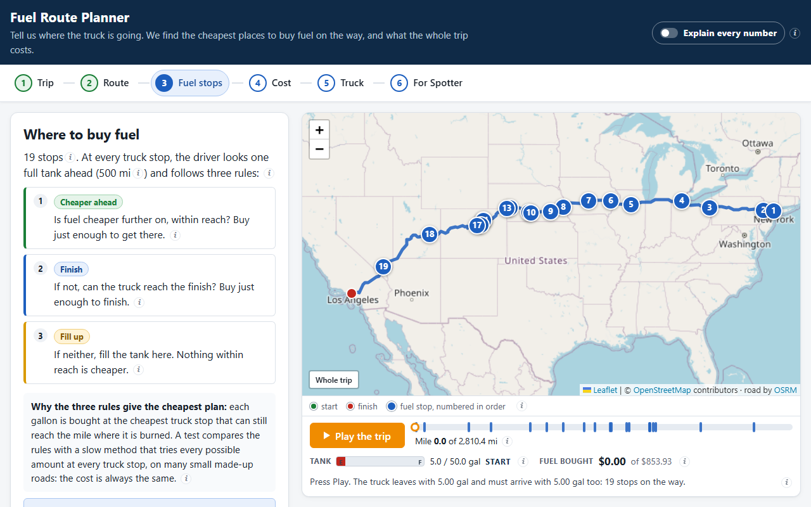
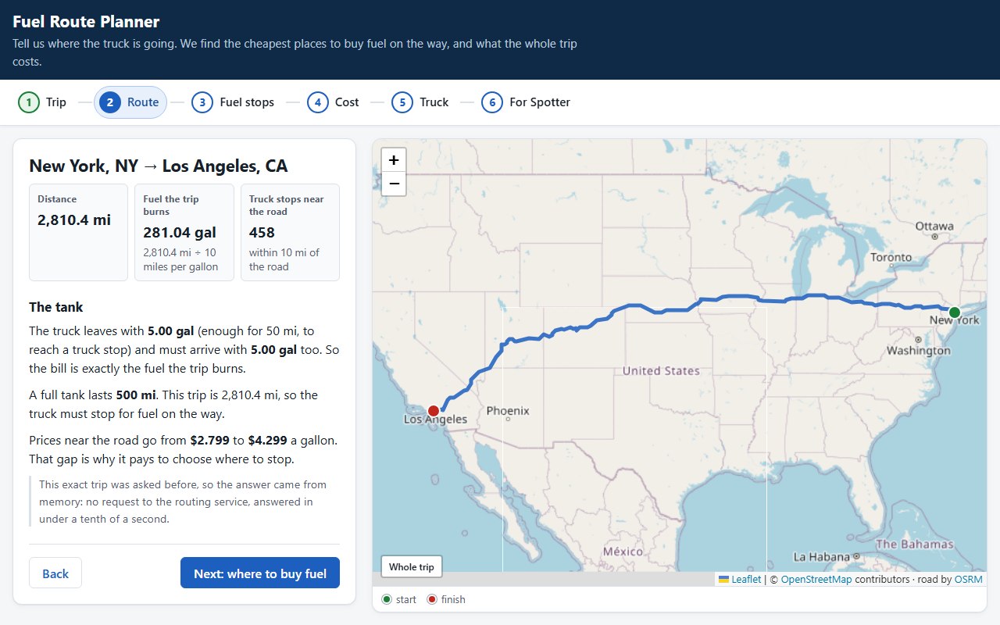
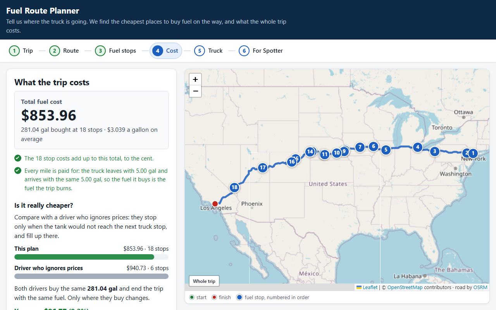
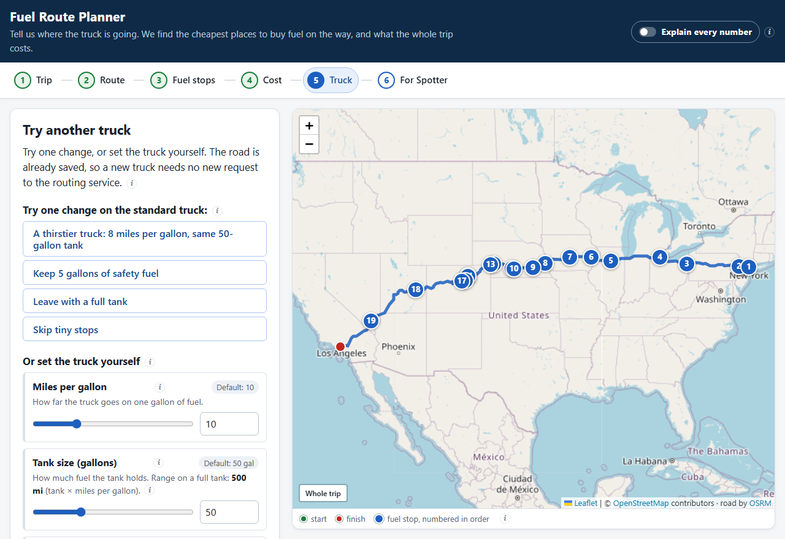

# Spotter Fuel Route API

A Django REST API for a truck trip inside the USA. Give it a start and a finish and it returns:

- the driving route, as map data and as a link to a map page;
- the **cheapest places to buy fuel** on the way, for a truck with a **500-mile range** and **10 miles per gallon**;
- how much to buy at each stop and the **total money spent on fuel**.

It calls a free routing API (OSRM) **once for a new trip** and **never** for a trip it has already planned.



---

## Quick start (6 commands)

Requires Python 3.12+ (Django 6.1). Tested with Python 3.14 on Windows 11.

```bash
python -m venv .venv
source .venv/bin/activate        # Windows PowerShell: .venv\Scripts\Activate.ps1 · Git Bash: source .venv/Scripts/activate
pip install -r requirements.txt
python manage.py migrate
python manage.py load_stations                           # ~2 s, places all stations offline
python manage.py runserver                               # http://127.0.0.1:8000
```

Open http://127.0.0.1:8000/api/route/map, or ask the API directly:

```bash
curl "http://127.0.0.1:8000/api/route?start=New%20York,%20NY&finish=Los%20Angeles,%20CA"
```

Postman: import `postman/collection.json` (variable `baseUrl` = `http://127.0.0.1:8000`). The demo video uses requests 1, 3 and 7.

## The page: one trip in six steps

The page at `/api/route/map` is a client of the same `GET /api/route` that Postman calls. It walks through one trip and
explains it in plain words:

1. **Trip**: type a start and a finish (with suggestions of US places), or pick an example.
2. **Route**: the road, its length, the fuel it burns, what the truck leaves with, and why it must stop.
3. **Fuel stops**: the three rules, every stop with the rule that chose it and why, and **Play the trip** to watch the tank.
4. **Cost**: the total, checked to the cent, and a driver who ignores prices for comparison.
5. **Truck**: miles per gallon, tank size, safety fuel, tank when leaving and “Skip tiny stops”. The road is already
   saved, so a new truck needs no new call to OSRM. “What changed” says what changed and why.
6. **For Spotter**: each point of the assignment, how it is met and the proof on this trip, always with the standard truck.

| Route | Cost | Truck |
|-------|------|-------|
|  |  |  |

### Every number explains itself

Every value on the page has a small **i** button next to it, and so do the ideas behind them (the three rules, the
tank, the driver who ignores prices, the caches, the checks…). Click or tap one to open a card with five parts:
**What it is · Where it comes from · How it's calculated · Why this way · In the code**. "How it's calculated" redoes
the formula with this trip's own numbers (for example `2,810.4 mi ÷ 10 mpg = 281.04 gal`, or a stop's arrival,
purchase and cost line by line), and "In the code" names the file and the function. "See also" opens related cards.
A card opens on what it is, this trip's numbers and why; where it comes from, the code and "Good to know" are folded.
Esc, ×, or a click outside closes it; on a phone it opens as a sheet at the bottom. The **Explain every number** switch
in the header makes every button stand out and opens every section of the cards.

The cards live in one file, `fuelroute/static/fuelroute/js/explain.js` (`EXPLAINERS`, keyed by the value's `data-live`
path or `concept:<name>`); `explain-ui.js` draws the buttons and the card. `fuelroute/tests/test_explain.py` checks that
every value has a card, every card has the five parts and stays short (three sentences a section), every code
reference exists, the live formulas print the right numbers, and no button sits inside a label, a row header or a
live region.

## The algorithm in plain words

**Candidates.** A truck stop of the price file is a candidate if it is within **10 miles** of the road. Each candidate
gets a mile marker: how far along the road it is.

**The tank at the start.** By default the truck leaves with 50 miles of fuel (5 gal), just enough to reach a truck
stop, and must arrive with the same 5 gal. So the bill is exactly the fuel the trip burns. (If the first truck stop is
further away, it leaves with enough to reach it, and arrives with that much too.) With `start_tank=full` it leaves
with a free full tank and only the fuel bought on the way is counted.

**Three rules.** At every truck stop the driver looks one full tank ahead (500 miles) and asks:

1. **Cheaper ahead?** If a cheaper truck stop is within reach, buy just enough fuel to get to the nearest one.
2. **Finish?** If not, and the finish is within reach, buy just enough to finish.
3. **Fill up.** If neither, fill the tank here: nothing within reach is cheaper. Then drive on to the cheapest truck
   stop within reach.

**Why it is the cheapest.** Each gallon is bought at the cheapest truck stop that can still reach the mile where it is
burned: a gallon burned at mile *m* can only come from a stop at most one tank before *m*, and the rules always buy it
at the cheapest of those. This is the classic greedy answer to the "gas station problem" on a fixed road with one price
per stop. A test (`test_optimizer::test_greedy_matches_exact_dp`) compares it with a slow method that tries every
possible amount at every stop (dynamic programming over whole miles of fuel) on 90 small random roads: the cost is
always the same.

**Tiny stops (optional).** The rules may plan a stop that buys 1.2 gallons, because the next stop is a little cheaper.
That is still the cheapest plan. With `consolidate=true` (“Skip tiny stops” on the page) a stop that buys less than
**10 gal** is merged into a neighbour, if that costs at most **$1.00** more per merge.

**Example: New York, NY → Los Angeles, CA** (2,810.4 miles, real answer of 2026-10-08):

- Stop 3, Youngstown, OH, mile 401, $3.059 a gallon: fuel is cheaper in Toledo, OH (mile 566, $3.009), so it buys
  just enough to get there: 16.5 gal. *Rule 1.*
- Stop 9, Waco, NE, mile 1,340, $2.799: the cheapest price on the whole road. Nothing within reach is cheaper, so it
  fills all 50 gallons. *Rule 3.*
- Stop 19, North Las Vegas, NV, mile 2,521: no cheaper fuel before the finish, so it buys just enough to finish. *Rule 2.*
- Total: **$853.93** for 281.04 gal at 19 stops. A driver who ignores prices pays $957.87 at 6 stops: $103.94 more
  (10.9%).
- With “Skip tiny stops”: 12 stops for $855.53, $1.60 more.

**Speed.** Sorting the n candidates costs O(n log n) and each stop looks at the k candidates within one tank:
O(n log n + n·k), about 1 ms for the 455 candidates of New York → Los Angeles.

**The code, in the order a request runs:** `fuelroute/views.py` (`RoutePlanView`) → `services/planner.py`
(`plan_trip`) → `services/osrm.py` (`get_route`: the one call, cached) → `services/stations.py`
(`stations_along_route`: the 10-mile search, with numpy) → `services/optimizer.py` (`_greedy`: one branch per rule;
`_consolidate`: the merges) → `planner._money_rows` (money in `Decimal`, so the stops add up to the total to the cent).

## API

### `GET /api/route` (or `POST /api/route` with the same fields as JSON)

| Parameter | Required | Example | Meaning |
|-----------|----------|---------|---------|
| `start` | yes | `New York, NY` or `40.71,-74.00` | where the trip starts, in the USA |
| `finish` | yes | `Los Angeles, CA` | where it ends |
| `start_tank` | no | `empty` (default) or `full` | leave almost empty and pay for every mile, or leave with a free full tank |
| `mpg` | no | `8` | miles per gallon, 3 to 30 (default 10) |
| `max_range_miles` | no | `400` | miles on a full tank, 100 to 1500 (default 500); the tank is range ÷ mpg |
| `safety_reserve_gal` | no | `5` | fuel that must stay in the tank at every stop and at the finish (default 0) |
| `consolidate` | no | `true` | merge stops that buy under 10 gal into a neighbour (default `false`) |
| `include` | no | `details` | add how the plan was made and the other drivers it was compared with |

Any other parameter is a 400. Two more settings exist for experiments: `corridor_miles` (1 to 50) and `price_policy`
(`median`, `min` or `max` price of a station listed several times).

Response for New York, NY → Los Angeles, CA (real, trimmed):

```json
{
  "start":  {"query": "New York, NY", "label": "New York, NY", "lat": 40.66271, "lon": -73.93868, "geocoder": "offline"},
  "finish": {"query": "Los Angeles, CA", "label": "Los Angeles, CA", "lat": 34.01939, "lon": -118.41083, "geocoder": "offline"},
  "route":   {"distance_miles": 2810.4, "duration_hours": 50.31, "miles_outside_usa": 0.0},
  "vehicle": {"miles_per_gallon": 10.0, "tank_gallons": 50.0, "max_range_miles": 500.0, "safety_reserve_gal": 0.0, "start_tank": "empty", "consolidate": false, "...": "..."},
  "summary": {
    "total_fuel_cost": 853.93, "total_gallons_purchased": 281.04, "number_of_stops": 19, "average_price_paid": 3.0385,
    "start_fuel_gallons": 5.0, "end_fuel_gallons": 5.0, "candidate_stations_on_route": 455,
    "comparison": {"price_blind": {"total_fuel_cost": 957.87, "number_of_stops": 6, "...": "..."},
                   "savings_vs_price_blind": {"amount": 103.94, "percent": 10.9, "extra_stops": 13}},
    "...": "..."
  },
  "warnings": [],
  "fuel_stops": [
    {
      "stop": 3, "name": "SHEETZ #639", "city": "Youngstown", "state": "OH", "lat": 41.126835, "lon": -80.767927,
      "mile_marker": 401.0, "price_per_gallon": 3.059, "fuel_on_arrival_gallons": 0.0, "gallons": 16.5, "cost": 50.47,
      "decision": {"rule": "reach_cheaper", "reaches": {"stop": 4, "mile": 566.0}, "fills_tank": false,
                   "cheaper_station": {"name": "S&G #88", "city": "Toledo", "state": "OH", "mile": 566.0, "price_per_gallon": 3.009}}
    }
  ],
  "map": {
    "map_url": "http://127.0.0.1:8000/api/route/map?start=New+York%2C+NY&finish=Los+Angeles%2C+CA&start_tank=empty",
    "geojson": {"type": "FeatureCollection", "features": ["the route line", "start", "finish", "one point per stop"]}
  },
  "meta": {"external_api_calls": 1, "external_api_services": ["osrm"], "route_cache": "miss", "plan_cache": "miss", "settings_changed": []}
}
```

- Money is exact: each `cost` is `gallons × price_per_gallon` rounded to the cent, and the total is the sum of the stops.
- `decision`: which rule chose the stop (and, with `consolidate=true`, what a merge moved into it).
- `summary.comparison`: the same trip for a driver who ignores prices: same stations, same gallons, only where they buy changes.

### Errors

Every error has the body `{"error": "<code>", "detail": ..., "meta": {"external_api_calls": n, ...}}` (plus `field`
when it names one). The most common ones:

| Status | `error` | When |
|--------|---------|------|
| 400 | `invalid_request` | missing or unknown parameter, bad format, a value out of range (`detail` per field) |
| 400 | `location_not_found` | a place that cannot be found, or a state code that does not exist ("Austin, TZ") |
| 400 | `location_outside_usa` | "City, XX" with a Canadian province or a Mexican state ("Toronto, ON"), before any call |
| 400 | `same_location` | start and finish are the same place, even written differently ("Austin, TX" / "Austin, Texas") |
| 422 | `no_fuel_data_on_route` | the trip needs fuel and no station of the file is near the road |
| 422 | `no_reachable_fuel_station` | a stretch without stations is longer than the usable range; `gap_start` / `gap_end` say where |

The full list (with 404, 405, 415, 429, 502 and 503) is in the Reference below and in `GET /api/about`.

## Assumptions and limits

- **Pay for every mile (`start_tank=empty`, the default).** The truck leaves with 5 gal (50 miles, enough to reach a
  truck stop) and must arrive with the same 5 gal, so the total is the cost of the fuel the whole trip burns. With
  `start_tank=full` the first tank is free and only the fuel bought on the way is counted.
- **The range is used to the limit.** With no safety fuel the truck may reach a station with 0.0 gallons: 500 miles
  taken literally. `safety_reserve_gal=5` keeps 5 gallons in the tank everywhere.
- **Coordinates: exact for 3,602 stations, city-level for the rest.** The price file has no coordinates, only a city
  and a highway address ("I-44, EXIT 283 & US-69"). 3,602 of the 6,626 US stations sit at their exact position: their
  own fuel station in OpenStreetMap (1,804: the right name next to the exit in their address, or their store number)
  or that exit itself (1,798). That match was made once, ahead of time, by `scripts/build_station_coords.py` and saved
  in `data/station_coords.csv`; `load_stations` reads the file, so nothing is downloaded at run time. A name alone is
  not trusted (a town often has several stores of one chain), nor an exit more than 20 miles from the town with nothing
  of that name next to it: the other 2,955 stations take their city's position (US Census and GeoNames lists,
  offline), and the 10-mile corridor absorbs most of that error. 69 stations have no exact position and a city that is
  in neither list or has namesakes far apart, so they are left out.
  To refresh the positions: `python scripts/build_station_coords.py` (downloads OpenStreetMap data one state at a time
  from the Overpass API; `--offline` reuses the cache in `.cache/osm/`; the rules and the result are in
  `data/station_coords_report.md`), then `python manage.py load_stations`. `load_stations --no-coords` places every
  station at its city center, as before.
- **The detour to a station is not charged.** Distances use the mile markers on the road; a station up to 10 miles off
  the road counts as on it. On New York → Los Angeles, stop 16 (Aurora, CO) sits at the exit in its address (I-70,
  exit 283) while the route runs on I-76, 8.5 miles away, for 2.7 gal; “Skip tiny stops” merges it away. The page
  estimates what this leaves out: a stop's **i** card shows its detour there and back in miles, gallons and dollars, and
  the **i** of the total in the Cost step adds them up for the trip (about 69 miles, 6.9 gal and $21.55 on New York →
  Los Angeles). It is a straight-line estimate, shorter than the real drive. Nor is the detour's fuel kept in the tank:
  a stop reached with 0.0 gal may sit miles off the road; `safety_reserve_gal=5` covers about 50 miles.
- **Duration** comes from the public OSRM server, which uses a car profile, not a truck one.
- **Duplicated stations:** a station listed several times plans with the median of its prices.

### Known data gaps

- The price file has only 8 stations in California, all in its south-east corner. Los Angeles → New York works: its
  first station is in Jean, NV (mile 251), so the truck leaves with enough fuel to get there and the answer says so.
- San Francisco, CA → Los Angeles, CA has no station near the road: a 422 `no_fuel_data_on_route`. With
  `start_tank=full` it needs no stop (the page offers that button).
- The I-5 has no stations between Halsey, OR and Los Angeles: Seattle → Los Angeles is a 422 that says where the gap is.
- Alaska and Hawaii have no stations: a 422 before any routing call.

## External calls

| Request | Calls to OSRM |
|---------|---------------|
| A new trip | **1** (2 only if the first try fails and is retried) |
| The same trip again | **0** (plan cache, 1 hour) |
| The same trip with another truck or tank setting | **0** (route cache, 24 hours) |
| Invalid input, same place, outside the USA | **0** (rejected before routing) |
| `/api/places`, `/api/about`, the page itself | **0** |

Places are found in an offline index. Only free text that is not "City, ST" (a street address) goes to Nominatim, once,
and is cached.

## How it would scale

- **Redis** for the plan cache and the route cache, so every process shares them (today each process has its own).
- **Our own OSRM** with a truck profile, set with `OSRM_URL`: no fair-use limits, and truck durations.
- **PostGIS** with a spatial index when the price feed grows (today 6.5k stations fit in memory: about 30 ms per search).
- **Stateless workers** behind a load balancer: nothing is kept between requests except the caches.

## Tests

`pytest` runs **967 tests** in about 10 s, with no network: the only function that does HTTP fails in every test, and the
tests that need OSRM get a fake that records each call. A few tests run the page's JavaScript in Node.js when it is
installed (skipped otherwise).

- **Optimizer:** the rules against the exact method on 90 random roads, a tank that never goes below empty or above
  full, the merges (no gallon lost or invented, at most $1 each), and a price-blind driver that never beats the three
  rules alone (before merges).
- **API:** exactly 1 call for a new trip and 0 for a repeat or another truck, costs that add up to the cent, every
  error code with the same body, retries and rate limits.
- **Truck settings:** each setting changes the plan as it should with 0 calls, out-of-range values are a 400, and the
  plans match a golden file written before the settings existed.
- **Data:** the price file loader, place names, homonym cities, the exact positions (an exact row beats the city
  center, a doubtful one is ignored) and the OpenStreetMap matching rules, the corridor search against brute force.
- **Page:** it never plans by itself, has no hand-written numbers, asks exactly what Postman asks, and every value has an
  explanation card whose code references exist and whose live formulas print the right numbers.

---

## Reference

**Other endpoints.** `GET /api/places?q=chi&limit=8`: type-ahead of US places from the offline index (0 external calls).
`GET /api/about`: versions, truck defaults, parameter ranges, loaded data (with `geocoded_by_source`: how many
stations sit at their exact position and how many at their city center) and every error code. `GET /api/route/map`:
the page.

**All error codes.**

| Status | `error` | When |
|--------|---------|------|
| 400 | `parse_error` | the JSON body is broken (also 405 `method_not_allowed`, 406 `not_acceptable`, 415 `unsupported_media_type`) |
| 404 | `not_found` | unknown path under `/api/` |
| 422 | `no_fuel_data_in_region` | Alaska, Hawaii or a US territory (checked before routing) |
| 422 | `location_not_near_road` | the point is more than 5 miles from a road |
| 422 | `no_route` | OSRM finds no road between the two places |
| 429 | `rate_limited` | more than 60 trips per minute from one client (`Retry-After`) |
| 502 | `upstream_unavailable` | OSRM (or Nominatim) failed, after one retry |
| 503 | `upstream_busy` | OSRM (or Nominatim) is rate limiting us (`Retry-After`) |
| 503 | `station_data_not_loaded` | `load_stations` was never run |
| 503 | `station_data_changed` | `load_stations` replaced the data while the request ran; send it again |

**Measured** on 2026-10-07 (Windows 11, Intel Core Ultra 9 185H, Python 3.14, `runserver --noreload`, one request at a
time, `X-Response-Time-ms`), New York, NY → Los Angeles, CA: a new trip 1,826 ms (1,703 ms of it waiting for OSRM); the
same trip again 4.5 to 9.1 ms; another truck on the same trip (5 settings) 30 to 41 ms.

**Configuration** (environment variables): `MAX_RANGE_MILES` and `MILES_PER_GALLON` (the standard truck, 500 and 10),
`CORRIDOR_MILES` (10), `MIN_STOP_GALLONS` and `MAX_CONSOLIDATION_COST` (10 and 1.0, for `consolidate=true`),
`OSRM_URL`, `PLAN_CACHE_SECONDS` and `ROUTE_CACHE_SECONDS` (3600 and 86400), `RATE_LIMIT_PER_MINUTE` (60), `LOOM_URL`,
and the usual `DJANGO_DEBUG`, `DJANGO_SECRET_KEY`, `DJANGO_ALLOWED_HOSTS`. All of them are in `config/settings.py`.

**Layout.**

```
config/                     Django settings and URLs
fuelroute/serializers.py    input validation
fuelroute/views.py, urls.py the JSON API
fuelroute/web.py            the map page (templates/, static/: HTML, CSS, JavaScript, no build step)
fuelroute/services/         planner.py (one trip, start to answer), optimizer.py (the rules and merges),
                            stations.py (the corridor), osrm.py (the routing call), geocoding.py, places.py
fuelroute/management/       load_stations: reads the price file and the exact station positions
fuelroute/tests/            pytest
data/, postman/, docs/      price file, places index, US outline, exact station positions; the Postman collection;
                            screenshots
scripts/                    one-time builders of the data files (the app never runs them)
```

**Data licences.** See `data/NOTICE.md`. Fuel prices: the file given with the assignment. US Census Bureau files:
public domain. GeoNames: CC BY 4.0. Map data and the exact station positions (`data/station_coords.csv`, derived from
OpenStreetMap) © OpenStreetMap contributors (ODbL); routing by OSRM.
